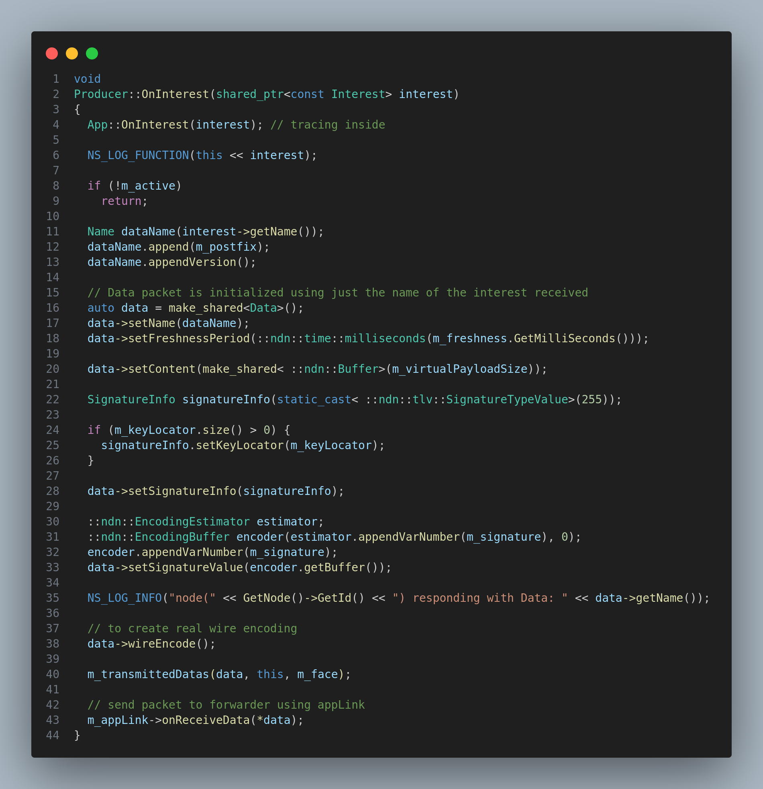

# Applications

## Prerequisites

1. Faces
2. Forwarder
3. Interest-in Pipeline
4. Core of ndnSIM

## Module Description

Applications are the dynamic part of the system, that can introduce new content into the system, or can request content from the system. Applications are the part of the system that can be used to simulate the real world applications that are built on top of the NDN stack. 

Applications are not the only factor that introduces non-determinsim in the ndnSIM system, but they are one of the major factors that introduces non-determinism in the system.Other factors that introduce non-determinism in the system are the forwarding strategies, the network topology, the network conditions, neighbor nodes, etc.

Applications use the event-driven simulator provided by the ns-3 to facilitate the communication between the nodes.
These call the simulator to schedule events, and the simulator calls the application to process the events. This is how the communication between the nodes is facilitated.

### How applications communicate with forwarder

Applications communicate with the forwarder using the `Face` class. Each application has a face that is used to communicate with the forwarder. The face is used to send the Interest packets to the forwarder, and the face is used to receive the Data packets from the forwarder. The face is also used to receive the Interest packets from the forwarder, and the face is used to send the Data packets to the forwarder. The abstraction used in `Face` class but [AppLinkService](https://github.com/named-data-ndnSIM/ndnSIM/blob/90d50396654dabad54b6979f2dc8fa929ade544c/model/ndn-app-link-service.hpp#L41) is used by the application to communicate with `Face` which in turns communicate with 
the forwarder.

The face is considered as having local scope as the face is only used to communicate with the forwarder. It is not used to communicate with the other applications. It is used to receive the Interest and Data packets from the forwarder using the [OnInterest](https://github.com/named-data-ndnSIM/ndnSIM/blob/90d50396654dabad54b6979f2dc8fa929ade544c/apps/ndn-app.hpp#L69) and [onData](https://github.com/named-data-ndnSIM/ndnSIM/blob/90d50396654dabad54b6979f2dc8fa929ade544c/apps/ndn-app.hpp#L75) methods.

The face is created when the applications starts.

The face is destroyed when the application stops.

### Types of applications

There are two types of applications that are part of the ndnSIM system. These are:

1. Producer
2. Consumer 

Technically, these two types of applications are not different in terms of the code, but they are different in terms of the functionality. The producer application is used to introduce new content into the system, and the consumer application is used to request content from the system. 

Both derive from the same Application base class. The Application base class is used to provide the common functionality that is shared by both the producer and the consumer applications.

These 3 functions are used to provide the common functionality that is shared by both the producer and the consumer applications. Few other functions are added to the producer and the consumer applications to provide the functionality that is specific to the producer and the consumer applications.

Example of the functions that are added to the producer and the consumer applications are:

1. Consumer: `SendPacket`, `onTimeout`
2. Producer: `m_freshness`, `m_signature`, etc.

#### Consumer Types

There are many different types of consumers that are part of the ndnSIM system. These are:

1. [Consumer CBR](https://github.com/named-data-ndnSIM/ndnSIM/blob/master/apps/ndn-consumer-cbr.hpp)
2. [Consumer Zipf-Mandelbrot](https://github.com/named-data-ndnSIM/ndnSIM/blob/master/apps/ndn-consumer-zipf-mandelbrot.hpp)
3. [Consumer Consumer Batches](https://github.com/named-data-ndnSIM/ndnSIM/blob/master/apps/ndn-consumer-batches.hpp)
4. [Consumer Window](https://github.com/named-data-ndnSIM/ndnSIM/blob/master/apps/ndn-consumer-window.hpp)

For more info about the individual applications, please refer to the individual application's documentation in the ndnSIM website.

## How consumer applications send Interest packets

Consumer applications send Interest packets using `SendPacket` method. This method is used to send the Interest packets to the forwarder. The forwarder then forwards the Interest packets to the other nodes in the network. The Interest packets are forwarded to the other nodes in the network using the forwarding strategy that is used by the forwarder. The forwarding strategy is used to decide which node to forward the Interest packet to.

<!--  -->

## How producer applications send Data packets

Producer applications doesn't have specific method to send the Data packets. This is the case because, the producers doesn't send data packet without interest packet. So when a interest packet is received, on the same instance, a data packet is created and send to the consumer. 

This has special usage even when we communicate between the nodes.

