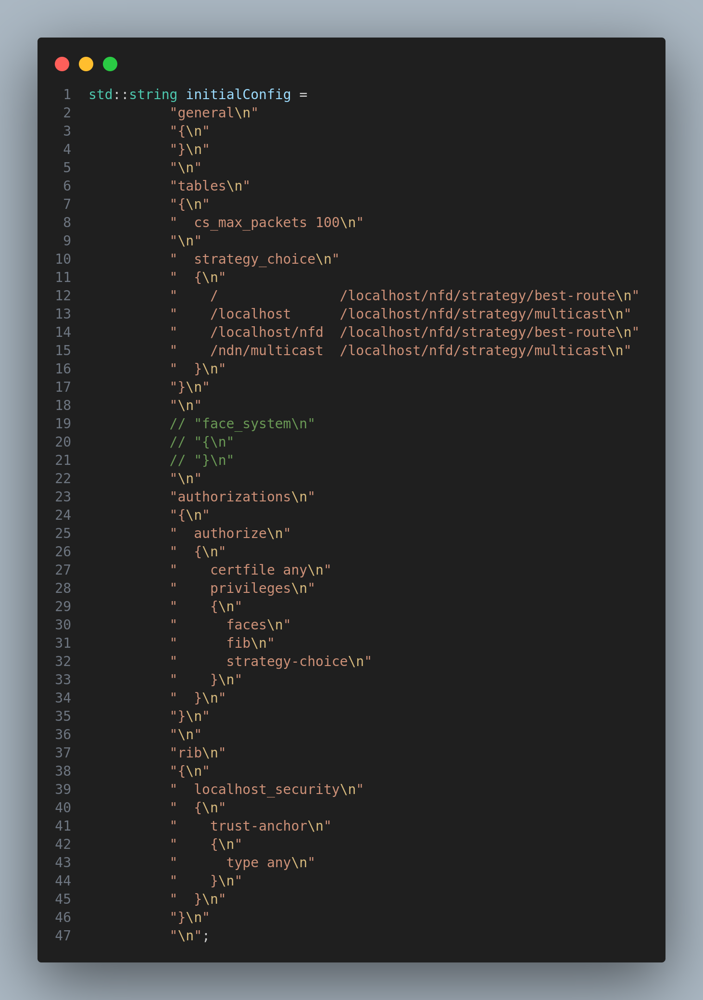

# Core of ndnSIM

## Module description

In this module, we will learn about the core of ndnSIM. What are the main components of ndnSIM? How do they work? What are the main classes and methods? How do they interact with each other? What are the main configuration parameters? How do they affect the simulation results? How ndnSIM itself is implemented in ns3 ? We will answer these questions in this module

## Procedure

Main components of ndnSIM:
1. `Forwarder`
2. `Strategy`
3. `Face`
4. `Application`

### Forwarder

The `Forwarder` is the core component of ndnSIM. It is responsible for forwarding Interest packets to the best matching Data packet. The `Forwarder` is implemented in the `ndnSIM/NFD/fw` directory. 

There is already a module dedicated to the `Forwarder`, please read it for more detail.

### Strategy

The `Strategy` is the component that decides how to forward an Interest packet. The `Strategy` is implemented in the `ndnSIM/NFD/daemon/fw/strategy` directory.

There is already a module dedicated to the `Strategy`, please read it for more detail.

### Face

The `Face` is the component that abstracts the communication channel between two entities (i.e applications , nodes). The `Face` is implemented in the `ndnSIM/NFD/face` directory.

There is already a module dedicated to the `Face`, please read it for more detail.

### Application

The `Application` is the component that generates Interest packets and receives Data packets. The `Application` is implemented in the `ndnSIM/aps` directory.

There is already a module dedicated to the `Application`, please read it for more detail.

As, you can see we already wrote a module for each component. So, why we are writing this module? The answer is that we want to give you a general overview of the core of ndnSIM. We will not go into details. We will just give you a general overview of the main classes and methods. We will also give you a general overview of the main configuration parameters. We will also give you a general overview of how ndnSIM itself is implemented in ns3.

Ndn is itself a class implemented to abstract the network layer in ns-3 `Node`.

It is done by `L3Protocol` class. The `L3Protocol` class is implemented in the `ndnSIM/model/ndn-l3-protocol.cpp` directory.

The `L3Protocol` class is instantiated and aggregated in the `Node` class. The `Node` class is implemented in the `ns-3-dev/src/node` directory.

We can access the `L3Protocol` class from the `Node` class by calling the `GetObject<L3Protocol>()` method.

`L3Protocol` class is responsible for creating the `Forwarder` and `Strategy` objects. It is also responsible for creating the `Face`, `Managers` and `Application` objects.

This class also takes a config file to instantiate  all the objects.

See below for the config file:

