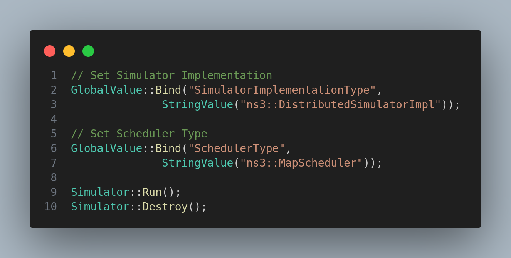
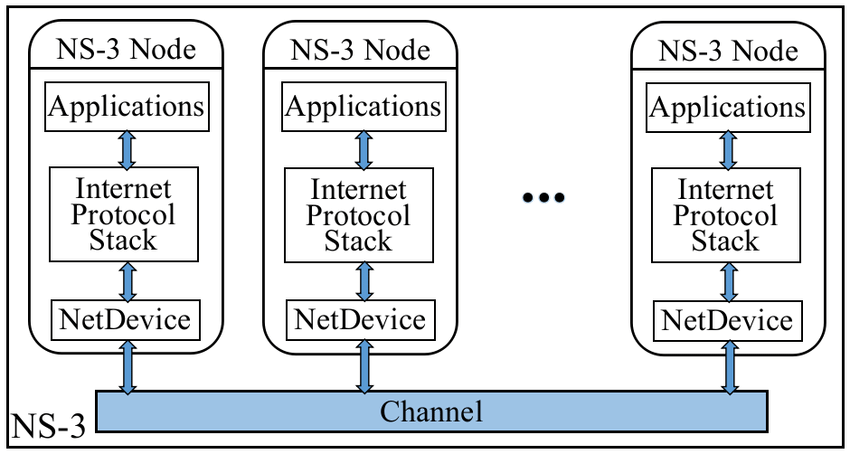
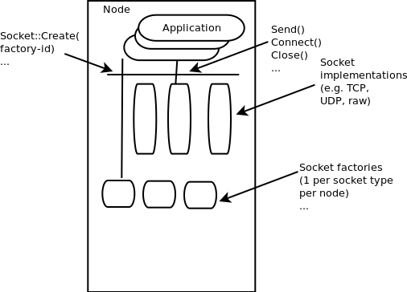

# Core of NS-3

## Module description

In this module, we will learn about the core of NS-3. What are the main classes and how they are used in the simulation.

## Procedure

There are five main components of NS-3:

1. Simulator
2. Node
3. Application
4. NetDevice
5. Channel

### Simulator

As the  name suggests, the simulator is the main component of the NS-3. It is used to run the simulation. It is implemented by the `Simulator` class in [simulator.h](https://github.com/nsnam/ns-3-dev-git/blob/master/src/core/model/simulator.h).

There are three types of the `Simulator`.

1. DefaultSimulatorImpl
2. DistributedSimulatorImpl
3. NullMessageSimulatorImpl

The `DefaultSimulatorImpl` is the default simulator. It is used to run the simulation on a single machine. The `DistributedSimulatorImpl` is used to run the simulation on multiple threads . The `NullMessageSimulatorImpl` is used to run the simulation in parallel without any message passing.

We use the simulator class in this way:

See this [link](https://www.nsnam.org/docs/manual/html/events.html) for more details.

To schedule an event, we use the `Schedule` method of the `Simulator` class. The `Schedule` method takes two arguments. The first argument is the time at which the event will be executed from present time. The second argument is the callback function which will be executed at the specified time.

The `Schedule` method returns an `EventId` which can be used to cancel the event.

To cancel an event, we use the `Cancel` method of the `Simulator` class. The `Cancel` method takes the `EventId` as an argument.

The `Run` method of the `Simulator` class is used to run the simulation. The `Run` method takes an optional argument which is the time for which the simulation will run. If no argument is passed, the simulation will run until there is no event left in the queue.

The `Stop` method of the `Simulator` class is used to stop the simulation. The `Stop` method takes an optional argument which is the time at which the simulation will stop. If no argument is passed, the simulation will stop immediately.

The `Destroy` method of the `Simulator` class is used to destroy the simulation. The `Destroy` method takes an optional argument which is the time at which the simulation will be destroyed. If no argument is passed, the simulation will be destroyed immediately.

### Node

The `Node` class is used to represent a node in the network. It is implemented by the `Node` class in [node.h](https://github.com/nsnam/ns-3-dev-git/blob/master/src/network/model/node.h)

It is used as the base for applications to run and also we use this a primary atom where the  `NetDevice` and `Channel` are attached to make communication possible.

Applications come on top layer, the network layer comes in the middle and the link layer comes at the bottom.

For, the matter of fact, we create an instance of ndnSIM main class and attach it to the node to make it possible to run ndnSIM simulation.

The `Node` class has the following methods:

1. `GetId`: It returns the id of the node.
2. `GetDevice`: It returns the device at the specified index.
3. `GetNDevices`: It returns the number of devices attached to the node.
4. `GetDeviceIterator`: It returns the iterator to the first device attached to the node.
5. `SetId`: It sets the id of the node.
6. `AddDevice`: It adds the device to the node.
7. `RemoveDevice`: It removes the device from the node.
8. `AggregateObject`: It aggregates the object to the node.
9. `GetAggregateIterator`: It returns the iterator to the first object aggregated to the node.
10. `GetNAggregate`: It returns the number of objects aggregated to the node.

These are some of the methods that we use in our ndnSIM simulation.

The most important method is the `AggregateObject` method. It is used to aggregate the object to the node. The `AggregateObject` method takes two arguments. The first argument is the pointer to the object to be aggregated. The second argument is the type of the object to be aggregated.

By using this, ndnSIM is able to access run inside the ns-3 framework.

We will see more on this in another module.

### Application

The `Application` class is used to represent an application in the network. It is implemented by the `Application` class in [application.h](https://github.com/dtaht/ns-3-codel-dev/blob/1c5fda95a62807daf34ae8cc8ec04325b8d04fa4/src/network/model/application.h#L61)

It is used as the base for applications to run.

The `Application` class has the following methods:

1. `GetNode`: It returns the node to which the application is attached.
2. `SetNode`: It sets the node to which the application is attached.
3. `GetStartTime`: It returns the start time of the application.
4. `SetStartTime`: It sets the start time of the application.
5. `GetStopTime`: It returns the stop time of the application.
6. `SetStopTime`: It sets the stop time of the application.

These are some of the methods that we use in our ndnSIM simulation.

We need not to deal with this class in most scenarios, because the apps provided by the ndnSIM with other base classes are flexible enough to deal with most of the scenarios.

The applications provided by the ndnSIM is already discussed in earlier modules.

Same like `Face` we here have socket which acts as the interface between the application and the network layer.

### NetDevice

The `NetDevice` class is used to represent a network device in the network. It is implemented by the `NetDevice` class in [net-device.h](https://github.com/dtaht/ns-3-codel-dev/blob/1c5fda95a62807daf34ae8cc8ec04325b8d04fa4/src/network/model/net-device.h#L75)

It is used as the base for network devices to run.

It is similar to the `Face` class in ndnSIM and network interface card in the real world.

We never need to deal with this class and `Face` is the only abstraction we need to deal with.

This comes under low level abstraction physical layer.

### Channel

The `Channel` class is used to represent a channel in the network. It is implemented by the `Channel` class in [channel.h](https://github.com/dtaht/ns-3-codel-dev/blob/1c5fda95a62807daf34ae8cc8ec04325b8d04fa4/src/network/model/channel.h#L43)

It act as the physical medium between the nodes.

Nodes are connected to each other via channels.
