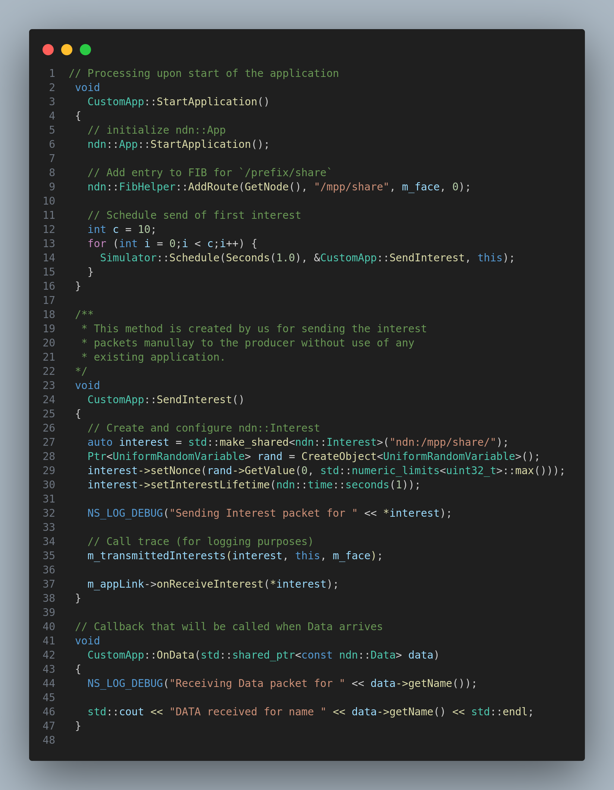
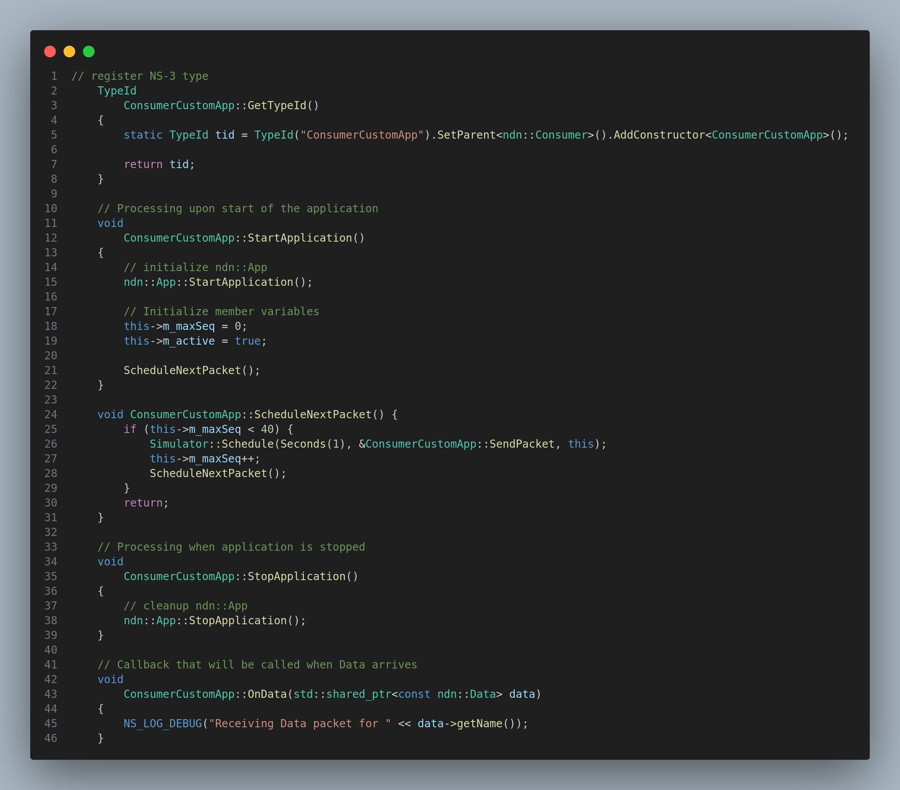

# Custom Apps

## Module Description

In this module, we will learn on how to create a custom app, that will send interest packets to the forwarder, and will receive data packets from the forwarder.

## Task

1. To create a consumer class, that will send constant number of interest packets per second to the forwarder, and will receive the data packets from the forwarder.

2. To create a producer class, that will only respond to the interest packets that are sent by the consumer class.

## Prerequisites

1. Faces
2. Forwarder
3. Knowledge about inheritance in C++

## Procedure

### Task 1 + 2

1. To create our own application, we can either make use of the pre-existing application base classes, or we can create our own application base class. We will do both of these things in this module.

2. The type of base class we use depends on the context. If suppose i am going to implement a consumer application, then i will use the `Consumer` base class. If suppose i am going to implement a producer application, then i will use the `Producer` base class. Else i don't use either and create my own base class.

The `Consumer` base class is defined in the [ndn-consumer.hpp](https://github.com/named-data-ndnSIM/ndnSIM/blob/master/apps/ndn-consumer.hpp)

The `Producer` base class is defined in the [ndn-producer.hpp](https://github.com/named-data-ndnSIM/ndnSIM/blob/master/apps/ndn-producer.hpp)

3. We will create a class that derives from the base class that we want to use. In this case, we will create a class that derives from the `App` base class.

In this type of application, we use our custom methods to send the interest packet as we are not using any pre-existing methods to send the interest packet.

> See the `SendInterest` method in the picture below.
>
> Also notice how i use the `SendInterest` method in the `StartApplication` method to send the interest packet repeatedly with a constant delay.

## Task 1

4. Now, We will create a class that derives from the `Consumer` base class.

Here we need not to create our own `SendInterest` method but rather we use the `SendPacket` method that is already defined in the `Consumer` base class.

5. This method will make use of the attributes defined in the `Consumer` base class to send the interest packet. So make sure that we set the parent of the class to be consumer class so that the attributes defined in the consumer class are available to the class that we are creating.

In the `SendInterest` method, i create my own interest packet and send to the forwarder using the applink service.

`ScheduleNextPacket` method is used to schedule the next interest packet to be sent to the forwarder.

6. For, producer class we will do the same thing as we did for the consumer class. We will create a class that derives from the `Producer` base class or from base `App` class. And depending on the context, either create our own `OnInterest` method or use the `OnInterest` method that is already defined in the `Producer` base class. 

> Note: The `OnInterest` method is used because there is no special method to send the data packet. The data packet is sent as a response to the interest packet that is received.