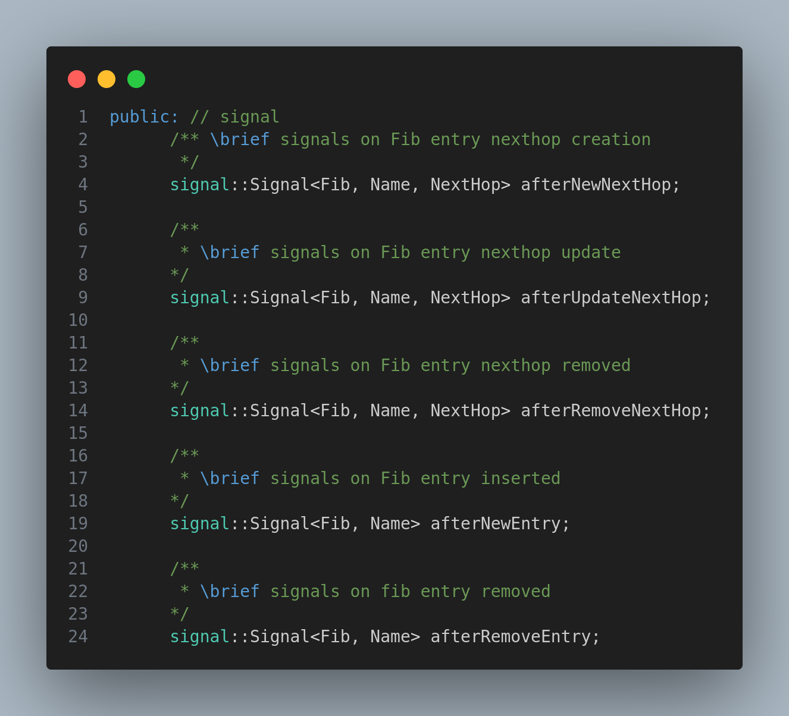
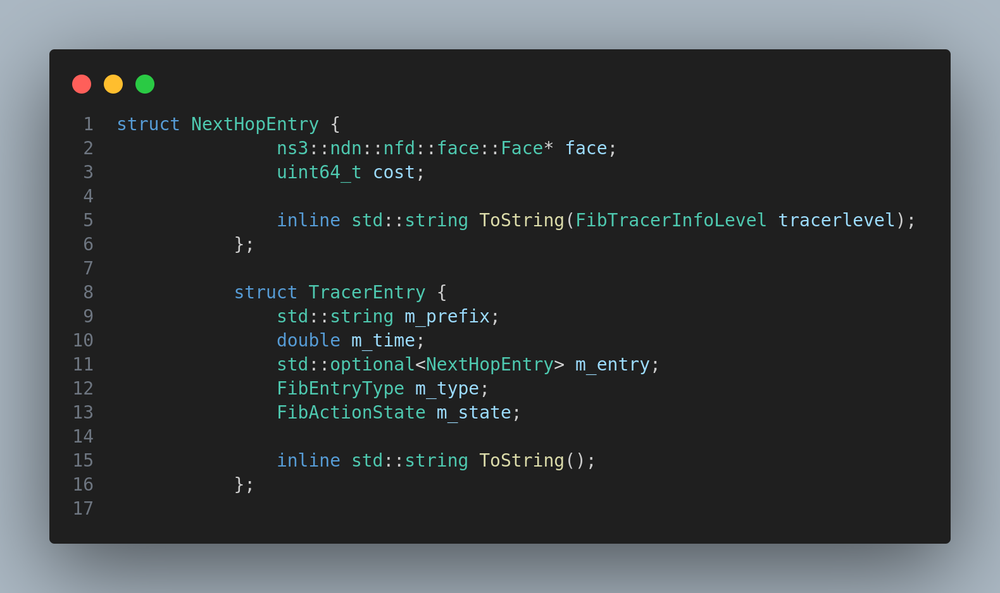
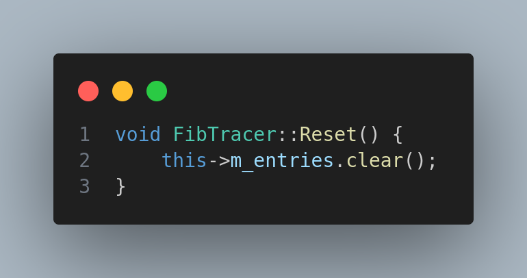
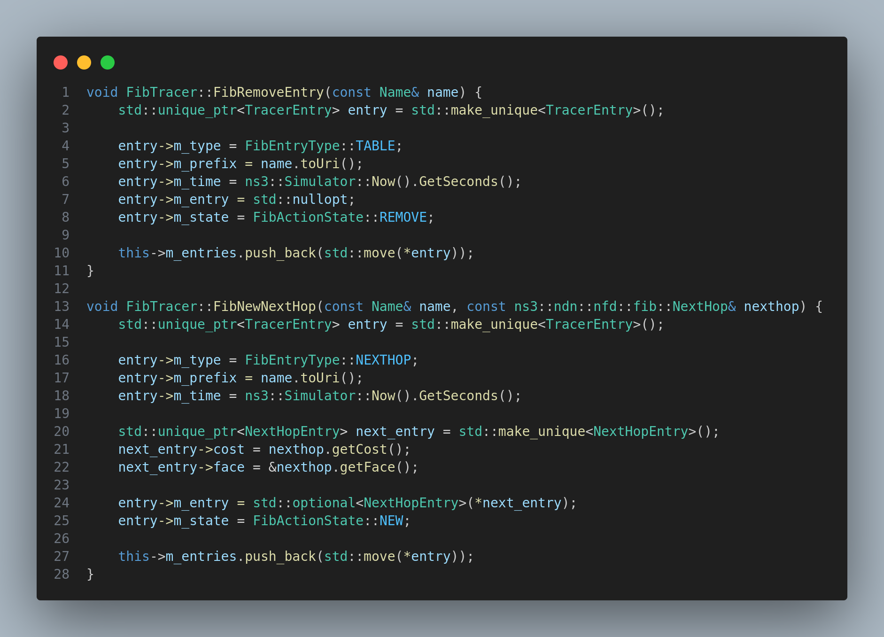
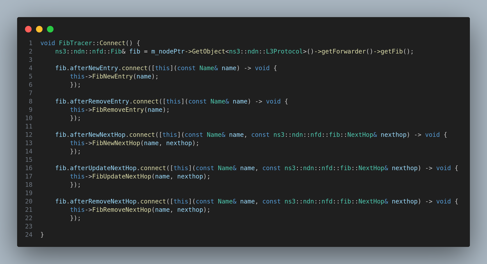

# Custom Tracer 

## Module Description

In this module, we will learn how to create a custom tracer.

Tracers are used to accumulate data during the simulation. The data can be used to plot graphs or to analyze the simulation.

We have more flexibility in creating a custom tracer. We can create a custom tracer for any class, for any variable and for any event.

## Task 

To create a custom tracer for the `Fib` class.

We will record the updates `Fib` table during the simulation.

## Procedure

1. Before creating a custom tracer, decide what data you want to record. In this case, we want to record the updates in the `Fib` table. So, we will record the `Fib` table after every update.

2. So as we need to record every update in the `Fib` table, we want some way to know when the `Fib` table is updated. But we as an independent module, we don't know. So we add new methods in the `Fib` class which will be called when the `Fib` table is updated.



Here, we have added five new methods in the `Fib` class. These methods will be called when the `Fib` table is updated. 

For example, when a new entry is added in the `Fib` table, the `afterNewEntry` method will be called. Similarly, when an entry is removed from the `Fib` table, the `afterRemoveEntry` method will be called.

3. These methods will be eventually attached to our Tracer class.

4. Now, we will create a new class `FibTracer`. And member variables to store the data we want to record.



Here, `m_` prefix is used to indicate that the variable is a member variable.

5. Also keep into consideration that we need to clear the trace once the time limit is reached. So, we will add a new method `Reset()` to clear the trace.



6. We also need to create five methods, each one corresponding to the five methods we added in the `Fib` class. These methods will be called when the `Fib` table is updated. These are the actual methods that will record the data.



Only few lines of code are shown here.

7. So on creating the instance of the class, the constructor will be called. We will attach the five methods to the `Fib` class. So, whenever the `Fib` table is updated, the corresponding method will be called.



8. And after stimulated time, the `Reset()` method will be called to clear the trace.

### Source code

```cpp
#include <ns3/simple-ref-count.h>
#include <ns3/node.h>
#include <ns3/node-container.h>
#include <ns3/ptr.h>
#include <ns3/nstime.h>
#include <ns3/ndnSIM/model/ndn-common.hpp>

#include <ns3/ndnSIM/NFD/daemon/face/face.hpp>
#include <ns3/ndnSIM/NFD/daemon/table/fib-entry.hpp>
#include <ns3/ndnSIM/NFD/daemon/table/fib-nexthop.hpp>
#include <ns3/ndnSIM/NFD/daemon/face/transport.hpp>

#include <iostream>
#include <string>
#include <memory>
#include <vector>
#include <optional>

#define stringify(x)  #x

#ifndef CCNX_CUSTOM_FIB_TRACER
#define CCNX_CUSTOM_FIB_TRACER

namespace ns3 {
    namespace ndn {
        namespace custom {

            enum FibTracerInfoLevel {
                NORMAL = 1,
                DEBUG = 2
            };

            enum FibEntryType {
                TABLE = 1,
                NEXTHOP = 2
            };

            enum FibActionState {
                NEW = 1,
                UPDATE = 2,
                REMOVE = 3
            };
            
            struct NextHopEntry {
                ns3::ndn::nfd::face::Face* face;
                uint64_t cost;

                inline std::string ToString(FibTracerInfoLevel tracerlevel);
            };

            struct TracerEntry {
                std::string m_prefix;
                double m_time;
                std::optional<NextHopEntry> m_entry;
                FibEntryType m_type;
                FibActionState m_state;

                inline std::string ToString();
            };


            namespace {
                std::string FibEntryTypeToString(FibEntryType entryType) {
                    switch (entryType) {
                    case FibEntryType::NEXTHOP:
                        return "NextHop";
                    case FibEntryType::TABLE:
                        return "Table";
                    default:
                        return "<None>";
                    }
                }

                std::string FibActionStateToString(FibActionState action) {
                    switch (action) {
                    case FibActionState::NEW:
                        return "New";
                    case FibActionState::UPDATE:
                        return "Update";
                    case FibActionState::REMOVE:
                        return "Remove";
                    default:
                        return "<None>";
                    }
                }

                std::string TransportStateToString(nfd::face::TransportState state) {
                    using nfd::face::TransportState;

                    switch (state) {
                    case TransportState::CLOSED:
                        return "Closed";
                    case TransportState::CLOSING:
                        return "Closing";
                    case TransportState::DOWN:
                        return "Down";
                    case TransportState::FAILED:
                        return "Failed";
                    case TransportState::UP:
                        return "Up";
                    case TransportState::NONE:
                        return "None";
                    default:
                        return "<None>";
                    }
                }
            };

            

            using TracerEntryList = std::vector<TracerEntry>;

            class FibTracer : public SimpleRefCount<FibTracer> {
            public:
                static void
                    InstallAll(const std::string& file, Time averagingPeriod = Seconds(0.5), FibTracerInfoLevel traceLevel = FibTracerInfoLevel::NORMAL);
                static void
                    Install(const NodeContainer& nodes, const std::string& file, Time averagingPeriod = Seconds(0.5), FibTracerInfoLevel traceLevel = FibTracerInfoLevel::NORMAL);
                static void
                    Install(Ptr<Node> node, const std::string& file, Time averagingPeriod = Seconds(0.5), FibTracerInfoLevel traceLevel = FibTracerInfoLevel::NORMAL);
                static Ptr<FibTracer>
                    Install(Ptr<Node> node, shared_ptr<std::ostream> outputStream,
                        Time averagingPeriod = Seconds(0.5), FibTracerInfoLevel traceLevel = FibTracerInfoLevel::NORMAL);
                FibTracer(shared_ptr<std::ostream> os, Ptr<Node> node, FibTracerInfoLevel traceLevel);
                FibTracer(shared_ptr<std::ostream> os, const std::string& node, FibTracerInfoLevel traceLevel);
                ~FibTracer();
                void Destroy();
                void
                    PrintHeader(std::ostream& os) const;
                void
                    Print(std::ostream& os) const;
                void PrintEntry(std::ostream& os, TracerEntry& entry) const;
                void SetTracerInfoLevel(FibTracerInfoLevel infoLevel);

            private:
                void
                    Connect();

                void FibNewEntry(const Name& name);
                void FibRemoveEntry(const Name& name);
                void FibNewNextHop(const Name& name, const ns3::ndn::nfd::fib::NextHop& nexthop);
                void FibUpdateNextHop(const Name& name, const ns3::ndn::nfd::fib::NextHop& nexthop);
                void FibRemoveNextHop(const Name& name, const ns3::ndn::nfd::fib::NextHop& nexthop);

            private:
                void
                    SetAveragingPeriod(const Time& period);

                void
                    Reset();

                void
                    PeriodicPrinter();


            private:
                std::string m_node;
                Ptr<Node> m_nodePtr;

                shared_ptr<std::ostream> m_os;

                Time m_period;
                EventId m_printEvent;

                TracerEntryList m_entries;
                FibTracerInfoLevel m_infolevel;
            };
        }
    }
}

#endif

```

```cpp
#include "custom-fib-tracer.hpp"

#include <ns3/ptr.h>
#include <ns3/names.h>
#include <ns3/node.h>
#include <ns3/node-container.h>
#include <ns3/node-list.h>

#include <ns3/ndnSIM/model/ndn-l3-protocol.hpp>
#include <ns3/ndnSIM/NFD/daemon/fw/forwarder.hpp>
#include <ns3/ndnSIM/NFD/daemon/face/face-common.hpp>

#include <string>
#include <iostream>
#include <fstream>
#include <memory>

NS_LOG_COMPONENT_DEFINE("ndn.CustomFibTracer");

namespace ns3 {
    namespace ndn {
        namespace custom {

            static std::list<std::tuple<shared_ptr<std::ostream>, std::list<Ptr<FibTracer>>>> g_tracers;

            std::string NextHopEntry::ToString(FibTracerInfoLevel tracerlevel) {
                switch (tracerlevel) {
                case FibTracerInfoLevel::NORMAL:
                    return "[ " + std::to_string(this->face->getId()) + " , " + std::to_string(this->cost) + " ]";
                case FibTracerInfoLevel::DEBUG:
                    return "[ " + std::to_string(this->face->getId()) + " , " + TransportStateToString(this->face->getState()) +
                        " , " + std::to_string(this->cost) + " ]";
                default:
                    return "<None>";
                }
            }

            void
                FibTracer::Destroy()
            {
                g_tracers.clear();
            }

            void
                FibTracer::InstallAll(const std::string& file, Time averagingPeriod /* = Seconds (0.5)*/,
                    FibTracerInfoLevel traceLevel)
            {
                using namespace boost;
                using namespace std;

                std::list<Ptr<FibTracer>> tracers;
                shared_ptr<std::ostream> outputStream;
                if (file != "-") {
                    shared_ptr<std::ofstream> os(new std::ofstream());
                    os->open(file.c_str(), std::ios_base::out | std::ios_base::trunc);

                    if (!os->is_open()) {
                        NS_LOG_ERROR("File " << file << " cannot be opened for writing. Tracing disabled");
                        return;
                    }

                    outputStream = os;
                }
                else {
                    outputStream = shared_ptr<std::ostream>(&std::cout, std::bind([] {}));
                }

                for (NodeList::Iterator node = NodeList::Begin(); node != NodeList::End(); node++) {
                    Ptr<FibTracer> trace = Install(*node, outputStream, averagingPeriod, traceLevel);
                    tracers.push_back(trace);
                }

                if (tracers.size() > 0) {
                    tracers.front()->PrintHeader(*outputStream);
                    *outputStream << "\n";
                }

                g_tracers.push_back(std::make_tuple(outputStream, tracers));
            }

            void
                FibTracer::Install(const NodeContainer& nodes, const std::string& file,
                    Time averagingPeriod, FibTracerInfoLevel traceLevel)
            {
                using namespace boost;
                using namespace std;

                std::list<Ptr<FibTracer>> tracers;
                shared_ptr<std::ostream> outputStream;
                if (file != "-") {
                    shared_ptr<std::ofstream> os(new std::ofstream());
                    os->open(file.c_str(), std::ios_base::out | std::ios_base::trunc);

                    if (!os->is_open()) {
                        NS_LOG_ERROR("File " << file << " cannot be opened for writing. Tracing disabled");
                        return;
                    }

                    outputStream = os;
                }
                else {
                    outputStream = shared_ptr<std::ostream>(&std::cout, std::bind([] {}));
                }

                for (NodeContainer::Iterator node = nodes.Begin(); node != nodes.End(); node++) {
                    Ptr<FibTracer> trace = Install(*node, outputStream, averagingPeriod, traceLevel);
                    tracers.push_back(trace);
                }

                if (tracers.size() > 0) {
                    tracers.front()->PrintHeader(*outputStream);
                    *outputStream << "\n";
                }

                g_tracers.push_back(std::make_tuple(outputStream, tracers));
            }

            void
                FibTracer::Install(Ptr<Node> node, const std::string& file,
                    Time averagingPeriod, FibTracerInfoLevel traceLevel)
            {
                using namespace boost;
                using namespace std;

                std::list<Ptr<FibTracer>> tracers;
                shared_ptr<std::ostream> outputStream;
                if (file != "-") {
                    shared_ptr<std::ofstream> os(new std::ofstream());
                    os->open(file.c_str(), std::ios_base::out | std::ios_base::trunc);

                    if (!os->is_open()) {
                        NS_LOG_ERROR("File " << file << " cannot be opened for writing. Tracing disabled");
                        return;
                    }

                    outputStream = os;
                }
                else {
                    outputStream = shared_ptr<std::ostream>(&std::cout, std::bind([] {}));
                }

                Ptr<FibTracer> trace = Install(node, outputStream, averagingPeriod, traceLevel);
                tracers.push_back(trace);

                if (tracers.size() > 0) {
                    tracers.front()->PrintHeader(*outputStream);
                    *outputStream << "\n";
                }

                g_tracers.push_back(std::make_tuple(outputStream, tracers));
            }

            Ptr<FibTracer>
                FibTracer::Install(Ptr<Node> node, shared_ptr<std::ostream> outputStream,
                    Time averagingPeriod, FibTracerInfoLevel traceLevel)
            {
                NS_LOG_DEBUG("Node: " << node->GetId());

                Ptr<FibTracer> trace = Create<FibTracer>(outputStream, node, traceLevel);
                trace->SetAveragingPeriod(averagingPeriod);

                return trace;
            }

            FibTracer::FibTracer(shared_ptr<std::ostream> os, Ptr<Node> node, FibTracerInfoLevel traceLevel)
                : m_nodePtr(node)
                , m_os(os)
                , m_infolevel(traceLevel)
            {
                m_node = boost::lexical_cast<std::string>(m_nodePtr->GetId());

                Connect();

                std::string name = Names::FindName(node);
                if (!name.empty()) {
                    m_node = name;
                }
            }

            FibTracer::FibTracer(shared_ptr<std::ostream> os, const std::string& node, FibTracerInfoLevel traceLevel)
                : m_node(node)
                , m_os(os)
                , m_infolevel(traceLevel)
            {
                Connect();
            }

            FibTracer::~FibTracer() {};

            void FibTracer::Connect() {
                ns3::ndn::nfd::Fib& fib = m_nodePtr->GetObject<ns3::ndn::L3Protocol>()->getForwarder()->getFib();

                fib.afterNewEntry.connect([this](const Name& name) -> void {
                    this->FibNewEntry(name);
                    });

                fib.afterRemoveEntry.connect([this](const Name& name) -> void {
                    this->FibRemoveEntry(name);
                    });

                fib.afterNewNextHop.connect([this](const Name& name, const ns3::ndn::nfd::fib::NextHop& nexthop) -> void {
                    this->FibNewNextHop(name, nexthop);
                    });

                fib.afterUpdateNextHop.connect([this](const Name& name, const ns3::ndn::nfd::fib::NextHop& nexthop) -> void {
                    this->FibUpdateNextHop(name, nexthop);
                    });

                fib.afterRemoveNextHop.connect([this](const Name& name, const ns3::ndn::nfd::fib::NextHop& nexthop) -> void {
                    this->FibRemoveNextHop(name, nexthop);
                    });

            }

            void FibTracer::FibNewEntry(const Name& name) {
                std::unique_ptr<TracerEntry> entry = std::make_unique<TracerEntry>();

                entry->m_type = FibEntryType::TABLE;
                entry->m_prefix = name.toUri();
                entry->m_time = ns3::Simulator::Now().GetSeconds();
                entry->m_entry = std::nullopt;
                entry->m_state = FibActionState::NEW;

                this->m_entries.push_back(std::move(*entry));
            }

            void FibTracer::FibRemoveEntry(const Name& name) {
                std::unique_ptr<TracerEntry> entry = std::make_unique<TracerEntry>();

                entry->m_type = FibEntryType::TABLE;
                entry->m_prefix = name.toUri();
                entry->m_time = ns3::Simulator::Now().GetSeconds();
                entry->m_entry = std::nullopt;
                entry->m_state = FibActionState::REMOVE;

                this->m_entries.push_back(std::move(*entry));
            }

            void FibTracer::FibNewNextHop(const Name& name, const ns3::ndn::nfd::fib::NextHop& nexthop) {
                std::unique_ptr<TracerEntry> entry = std::make_unique<TracerEntry>();

                entry->m_type = FibEntryType::NEXTHOP;
                entry->m_prefix = name.toUri();
                entry->m_time = ns3::Simulator::Now().GetSeconds();

                std::unique_ptr<NextHopEntry> next_entry = std::make_unique<NextHopEntry>();
                next_entry->cost = nexthop.getCost();
                next_entry->face = &nexthop.getFace();

                entry->m_entry = std::optional<NextHopEntry>(*next_entry);
                entry->m_state = FibActionState::NEW;

                this->m_entries.push_back(std::move(*entry));
            }

            void FibTracer::FibUpdateNextHop(const Name& name, const ns3::ndn::nfd::fib::NextHop& nexthop) {
                std::unique_ptr<TracerEntry> entry = std::make_unique<TracerEntry>();

                entry->m_type = FibEntryType::NEXTHOP;
                entry->m_prefix = name.toUri();
                entry->m_time = ns3::Simulator::Now().GetSeconds();

                std::unique_ptr<NextHopEntry> next_entry = std::make_unique<NextHopEntry>();
                next_entry->cost = nexthop.getCost();
                next_entry->face = &nexthop.getFace();

                entry->m_entry = std::optional<NextHopEntry>(*next_entry);
                entry->m_state = FibActionState::UPDATE;

                this->m_entries.push_back(std::move(*entry));
            }

            void FibTracer::FibRemoveNextHop(const Name& name, const ns3::ndn::nfd::fib::NextHop& nexthop) {
                std::unique_ptr<TracerEntry> entry = std::make_unique<TracerEntry>();

                entry->m_type = FibEntryType::NEXTHOP;
                entry->m_prefix = name.toUri();
                entry->m_time = ns3::Simulator::Now().GetSeconds();

                std::unique_ptr<NextHopEntry> next_entry = std::make_unique<NextHopEntry>();
                next_entry->cost = nexthop.getCost();
                next_entry->face = &nexthop.getFace();

                entry->m_entry = std::optional<NextHopEntry>(*next_entry);
                entry->m_state = FibActionState::REMOVE;

                this->m_entries.push_back(std::move(*entry));
            }

            void FibTracer::Reset() {
                this->m_entries.clear();
            }

            void FibTracer::SetTracerInfoLevel(FibTracerInfoLevel infoLevel) {
                this->m_infolevel = infoLevel;
            }

            void
                FibTracer::SetAveragingPeriod(const Time& period)
            {
                m_period = period;
                m_printEvent.Cancel();
                m_printEvent = Simulator::Schedule(m_period, &FibTracer::PeriodicPrinter, this);
            }

            void
                FibTracer::PeriodicPrinter()
            {
                Print(*m_os);
                Reset();

                m_printEvent = Simulator::Schedule(m_period, &FibTracer::PeriodicPrinter, this);
            }

            void
                FibTracer::PrintHeader(std::ostream& os) const
            {
                os << "Time"
                    << "\t\t"

                    << "Node"
                    << "\t\t"

                    << "Type"
                    << "\t\t"

                    << "Action"
                    << "\t\t"

                    << "Prefix"
                    << "\t\t"

                    << "Value\t";
            }

            void FibTracer::PrintEntry(std::ostream& os, TracerEntry& entry) const {
                std::function<std::string(ns3::Ptr<ns3::Node>)> getNodeName =
                    [](ns3::Ptr<ns3::Node> node) -> std::string {
                    std::string _id = std::to_string(node->GetId());
                    std::string _name = ns3::Names::FindName(node->GetObject<ns3::Node>());

                    return _id + "(" + _name + ")";
                    };

                os << entry.m_time << "\t\t" <<
                    getNodeName(this->m_nodePtr) << "\t\t" <<
                    FibEntryTypeToString(entry.m_type) << "\t\t" <<
                    FibActionStateToString(entry.m_state) << "\t\t" <<
                    entry.m_prefix << "\t\t";

                if (entry.m_type == FibEntryType::NEXTHOP) {
                    BOOST_ASSERT(entry.m_entry.has_value());

                    NextHopEntry det = entry.m_entry.value();
                    os << det.ToString(this->m_infolevel);
                }

                os << "\n";
            }

            void FibTracer::Print(std::ostream& os) const {
                for (const TracerEntry& entry : this->m_entries) {
                    PrintEntry(os, const_cast<TracerEntry&>(entry));
                }
            }
        }
    }
}

````