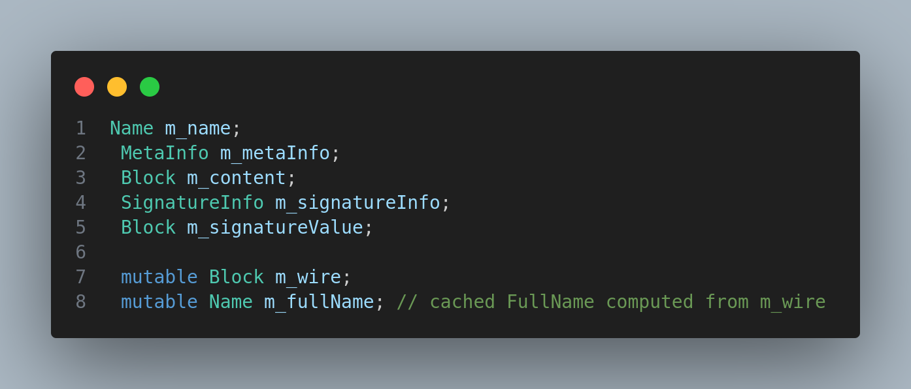
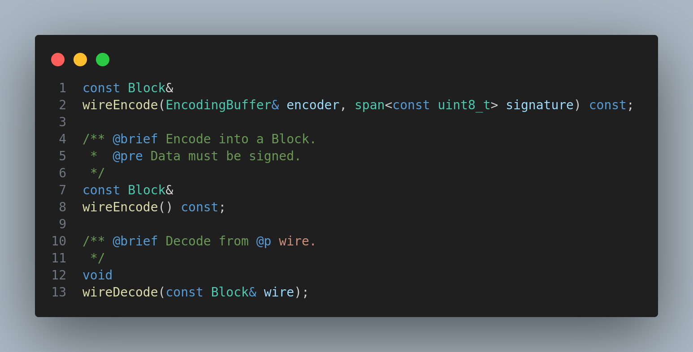
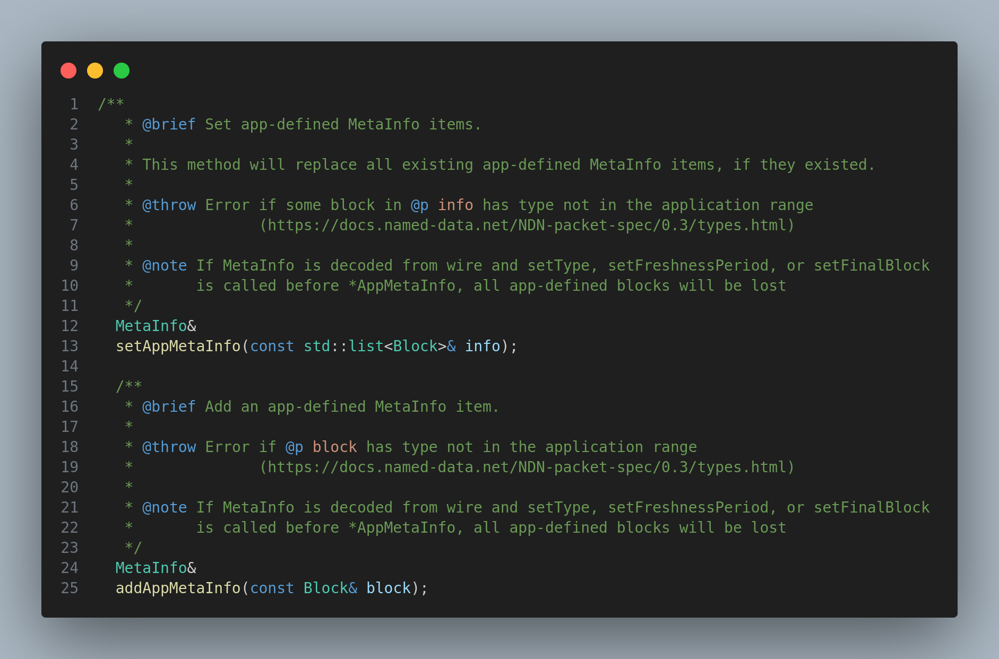
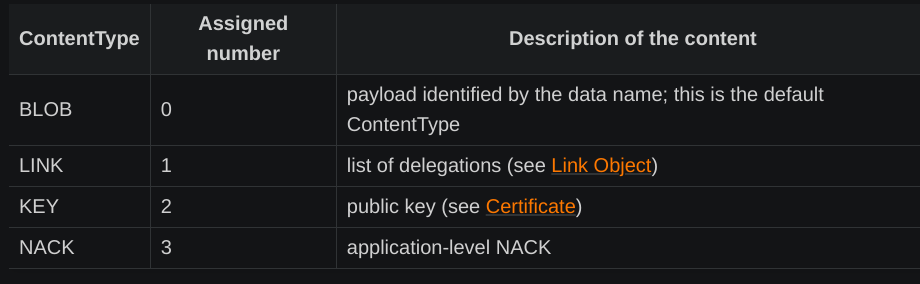
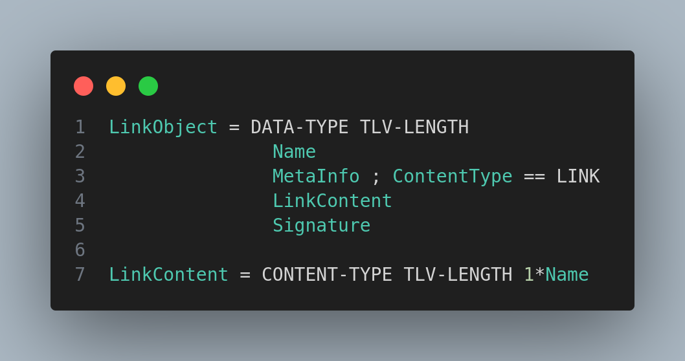

# Data packets 

<!--What is data packets, what are the fields present inside it, which classs represents it,how it encoded,how it is accessed by the forwarder-->

## Module Description

In this module, we will learn about the Data packet. What are the main fields inside the Data packet, how it is communicated in the NDN network, and how it is handled by the NDN forwarder.

## Procedure

### What is a Data packet?

A Data packet is a packet that is used by the producer to send data to the consumer. It can of any type, it can be a video, audio, text, etc.  and of any size.

Data packet is implemented by `Data` class in  [data.hpp](https://github.com/named-data-ndnSIM/ndn-cxx/blob/2b51e5796415b5d41fe268b35250b9453f16d3d6/ndn-cxx/data.hpp#L37)

### What are the main fields inside the Data packet?

The main fields inside the Data packet are:

1. Name
2. Meta Info
3. Content
4. Signature



Taken from the private field section of the Data class.

The keyword `mutable` is used to specify that the field can be changed by const methods.

To understand the use, we must understand the use of constant function in c++.

We will understand this concept using an example from this class. `Data` class has many fields and we don't want some function (i.e `wireEncode`) to change the values of user set variables. But when encoding the private variables set by the user, we use `wireEncode` function which shouldn't change the value of user set variables. But the output of encoding is itself a member variable. Thus we want to change only that particular variable and not the user set variables. Thus we use `mutable` keyword.



See the constant keyword used in the `wireEncode` function. Also notice the absence of constant keyword in the `wireEncode` function of `Interest` class of signature 

```c++
void wireEncode(const Block& wire);
```

Here, we didn't use the const keyword because we want to change the value of the user set variables by decoding the wire format of the Data packet.

### How is Data packet communicated in the NDN network?

Data packet is processed in the same way as the Interest packet. The only difference is that the Data packet is sent by the producer to the consumer.

The Data packet is converted into `Block` format which defines ndn specific TLV format and then it is sent to the network using the `Face` class.

The `Forwarder` uses different set of methods to handle the incoming Data packet. The methods are:

```c++
void
   onIncomingData(const Data& data, const FaceEndpoint& ingress);

void
    onOutgoingData(const Data& data, const FaceEndpoint& egress);
```

The use of the methods can be understood from the name itself.

The `Data` class also contains `MetaInfo` class which contains the meta information about the Data packet content. The `MetaInfo` class contains the following fields:

1. ContentType
2. FreshnessPeriod
3. FinalBlockId
4. OtherTypeCode

To set the value of the `MetaInfo` class, we use the `setAppMetaInfo` method  and `addAppMetaInfo` of the `Data` class.



Each component of the `MetaInfo` class is considered as separate TLV field. The `ContentType` is of type `uint32_t` and is represented by the TLV type `0x18`. The `FreshnessPeriod` is of type `uint64_t` and is represented by the TLV type `0x19`. The `FinalBlockId` is of type `Name` and is represented by the TLV type `0x1a`. The `OtherTypeCode` is of type `Block` and is represented by the TLV type `0x1b`.

Thus we were able to add new field in the MetaInfo of the Data packet.

### Types of Data packets

There are not theoretically different but technically same. The types of Data packets are:



source: [NDN packet specification](https://docs.named-data.net/NDN-packet-spec/current/data.html#metainfo)

#### Normal Data packet

Normal Data packet is the Data packet that is sent by the producer to the consumer. It contains the content requested by the consumer.

#### Link Object

Link object doesn't carry any content to the user.It carries a list of one or more names (formerly known as “delegations”). These delegations are name of the ISP that host the data content required. SO, assume a case where the data producer is not able to announce globally their presence but the consumer is aware of it. So in this case, the consumer shall add the  ISP name in the `Interest` packet that can be used by the intermediate routers to forward the Interest packet to the corresponding ISP who host the data content.



See the TLV format of the Link Object.

#### Key

Key is the public key of the producer. It is used to verify the signature of the Data packet.

#### NACK

NACK is the negative acknowledgement. It is used to inform the consumer that the requested content is not available or when hop limit is exceeded.