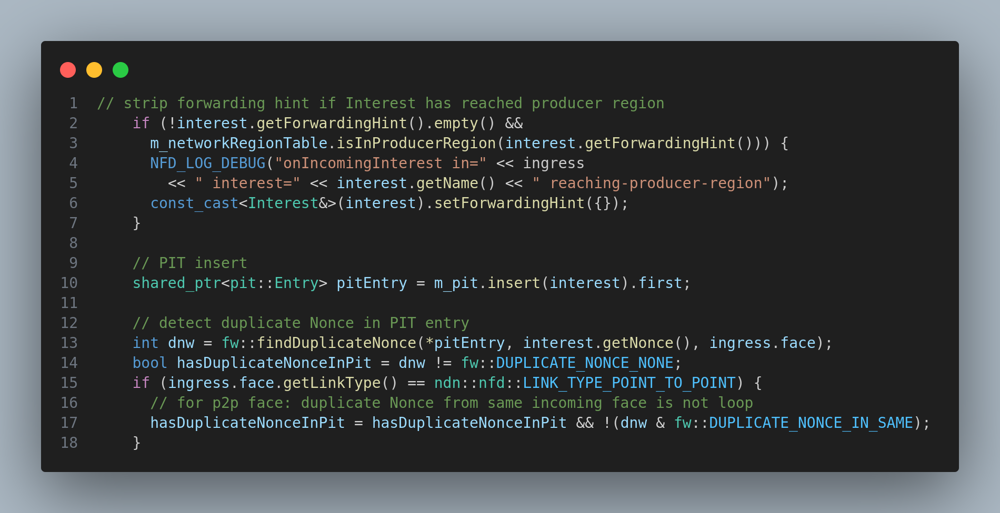
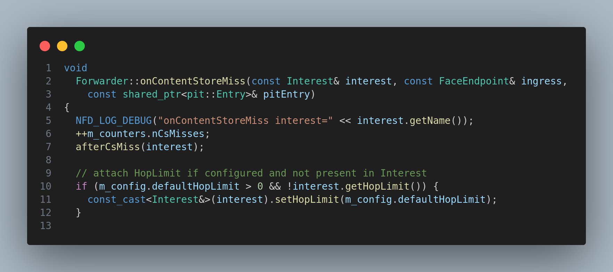

# Do's and Don'ts

## Module description

In this module, we will learn about the Do's and Don'ts of the NDN forwarder.

## Procedure

1. Always better visualize the topology of the network before starting the simulation. It will help you to understand the simulation better and help to avoid mistakes such as installing the wrong strategy on the wrong node.

2. Always simulate logs for particular nodes. Feel free to create own custom tracers to simulate logs for particular nodes.

3. Have knowledge about the objects that should be shared within all entities, and the objects that should be shared within a particular entity. For example, the `Interest` object should be shared within all entities, and the `Fib` object should be shared within a particular entity. Even `Face` object should be shared within particular entity.

4. Always use the `Face` object to send the `Interest` and `Data` packets. Do not use the `Node` object to send the `Interest` and `Data` packets.

5. Have idea of mutable and immutable objects. For example, `Interest` and `Data` objects are mutable objects, and `Face` and `Fib` objects are immutable objects. Shared and unique pointers are used to share mutable and immutable objects respectively.

See this  example taken from the `ndnSIM` source code `Forwarder` class.

See how `pit::Entry` is shared between `Pit` and `Forwarder` objects.

6. Adding to the pointer, we also must have idea about the reference to the objects. For example, `Interest` and `Data` objects are passed by reference, and `Face` and `Fib` objects are passed by value.

See how `Interest` is `const_cast` to `Interest&` and passed by reference to call `Interest::setHopLimit(uint8_t)` method.

7. Use `shared_from_this()` method to get the shared pointer of the object. For example, use `shared_from_this()` method to get the shared pointer of the `Face` object. But while passing, pass the reference of the object. For example, pass the reference of the `Face` object to the `sendInterest()` method.