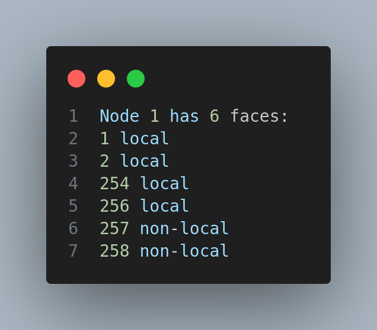

# Faces 

## Module Description

In this module, we will learn about the faces, how to create faces, what are the components of faces, how are they managed, and how to use them.

## Procedure

Faces are the main component of the NDN architecture.
They act as the abstraction over the communication channel over the `NetDevice` and the `Node` class.

Faces can be either of external type created due to the presence of a `NetDevice` or internal type created due to the presence of a `Application` class.

#### FaceManager

1. Faces are created by the `FaceManager` class.

2. The `FaceManager` class is a singleton class that manages all the faces in the system.

3. The ownership of the `Face` class object is with the `FaceManager` class.

4. The `FaceManager` class is responsible for creating, deleting, and managing the faces in the system.

#### FaceTable

The `FaceTable` class is a container class that stores all the faces in the system.

#### Other

Note that, the `Face` class object is not same as normal C++ object. It is non mutable singleton component in the system, so we must make use of smart pointer to access the `Face` class object.

If we didn't care to use the smart pointer, then we will get a multiple copies of the same `Face` class object and the system will not work as expected as the `Face` class object is a singleton class and we work multiple independent copies of the same object.


Link to the [FaceTable](https://github.com/named-data-ndnSIM/NFD/blob/361b381b9b552ff3341aa160858bea1d470d2122/daemon/fw/face-table.hpp#L38) class source code.


> 1. This above picture shows a snippet from the `FaceTable` class.
> 
> 2. Notice the use of smart pointer `shared_ptr` to access the `Face` class object.
>
> 3. `FaceTable` uses `std::map<FaceId, shared_ptr<Face>>` to store the faces in the system.

The `FaceId` assinged to the `Face` is defined by the scope of the `Face` class object. If it is non-local, we can expect the `FaceId` to be greater than 256.



> 1. This above picture is an example for the `FaceId` retrieved from the `FaceTable`.
>
> 2. It shows, that the particular node has 6 faces in the system with 4 being local and 2 being non-local.

Below is a code snippet on how to retrieve this info from the ns-3 `Node` class.


#### Internal components of the Face class

1. The `Face` class is made of two other classes which manages different abstraction layer of this class.

2. The two classes are `Transport` and `LinkService` class. Without any of these, the `Face` class is incomplete.

3. This can be seen from the face that the only constructor available for the `Face` class to create a object is of the form 

```c++
 Face(unique_ptr<LinkService> service, unique_ptr<Transport> transport);
```

4. The `Transport` class is responsible for the communication channel between the `Face` class and the `NetDevice` class.

5. The `LinkService` class is responsible for the communication channel between the `Face` class and the `Application` class.


> The above picture shows how `Application` class is creating it's own `Face` class with it's own `AppLinkService` class object and `NullTransport` and attaching it to the `L3protocol` class.

6. The `LinkService` object comes in various types depending on the scope where it used. `AppLinkService` is used for the internal faces for communication between the `Face` class and the `Application` class internally.


> 1. This above picture shows the protected member variables of the `App` class that inherits from the `Application` class.
>
> 2. See the `m_appLink` variable which is of type `AppLinkService`. Also notice that we didn't use the smart pointer to access the `AppLinkService` class object despite the fact that the `Face` object that it is pointing to is a singleton class.
>
> 3. This is because the `AppLinkService` class object is created by the `Application` class when staring the Application and is destroyed when the application is stopped. So, we don't need to worry about the ownership of the `AppLinkService` class object.
>
> 4. In fact, the `Face` class also doesn't want the ownership of the `AppLinkService`, that is why it is  using the unique pointer to access the `AppLinkService` class object.
>
> 5. But for the `Face` class object, we intend to use the smart pointer because it is managed by `FaceManager` class.

#### External components of the Face class

Here we will discuss about other functionalities of the `Face` class that is provided out of the box.


> 1. This above picture shows the private member variables of the `Face` class.
>
> 2. `FaceCounters` are used by the Tracers to get the statistics of the `Face` class. i.e. the number of interest/data packets sent, received, dropped, etc.
>
> 3. `m_metric` is used by the `Face` class to calculate the metric of the `Face` class object. This metric is used by the `Strategy` class to make the forwarding decision. (Cost based forwarding)
>
> 4. `m_channel` is used by the `Face` class to get the `Channel` class object. This `Channel` class object is the underlying communication channel between the `Face` class and the `NetDevice` class.

The `Face` class can be segregated based on the anotomy of number of endpoints in the system.

1. Point-to-Point (i.e wired link)
2. Multipoint (i.e ethernet)
3. Ad-hoc (i.e wireless)

Each endpoint is uniquely identified by the 
`FaceUri` class object.

Refer this link for more on [FaceUri](https://redmine.named-data.net/projects/nfd/wiki/FaceMgmt#Underlying-protocol-and-FaceUri-schemes)

Link for the [FaceUri](https://github.com/named-data-ndnSIM/ndn-cxx/blob/2b51e5796415b5d41fe268b35250b9453f16d3d6/ndn-cxx/net/face-uri.hpp#L44) source code.