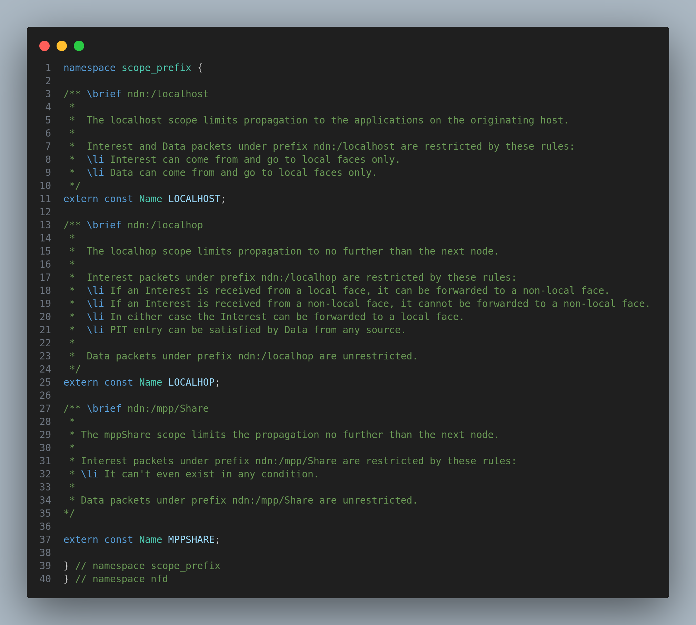
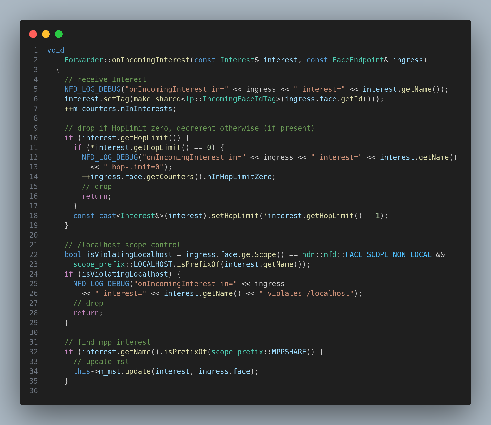
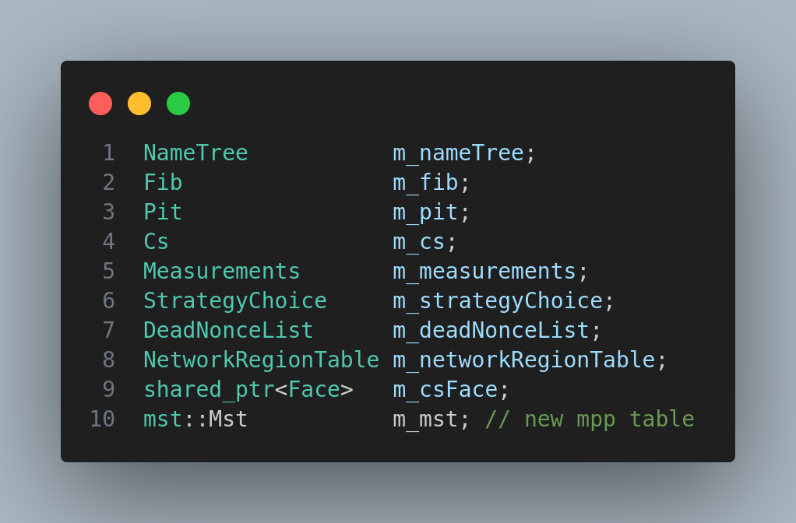
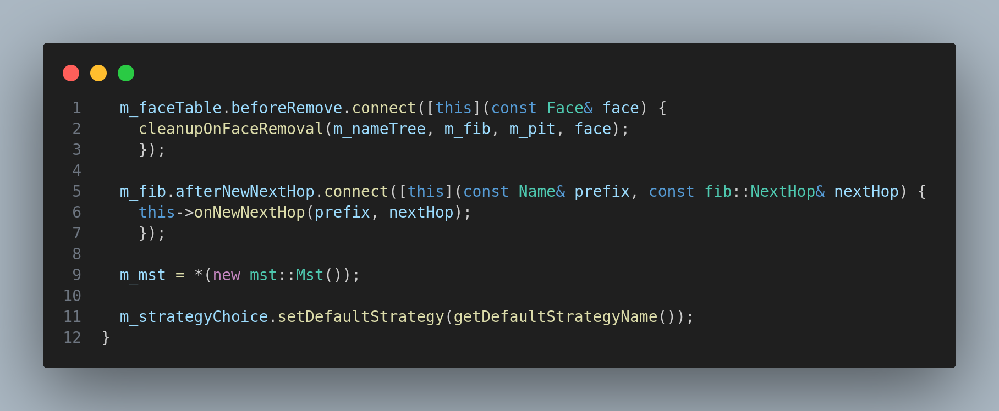

# Final Project I

## Module Description

In this module, we are going to apply all the concepts we have learned so far in the previous modules to create a new simulation using our custom forwarding strategy, custom table, custom application, and custom packet format, custom componenet logs.

## Task

To create a custom forwarding strategy MPP based on the liteNDN forwarding strategy.

For more info about the forwarding strategy, please refer to 
[Paper Link](https://ieeexplore.ieee.org/stamp/stamp.jsp?tp=&arnumber=9045742&tag=1)

## Procedure

1. Now we intend to create a custom forwarding strategy MPP based on the liteNDN forwarding strategy.

2. Before, it is preliminary to have little knowledge about the MPP forwarding strategy. The MPP forwarding stragey is based on the fact the if the neighboring router's share the information that has been through them, then the router's near to it  can make a better decision about the forwarding of the Interest packet.

3. So to implement this, we need as a router should send the information about thep packets that has been through us constantly to the neighboring routers. To store this information in each router, we will use our own custom table from the `own_own_table` module.

4. Thus, the process as overall again is that routers keep sharing the information about the packets that has been through them to neighboring routers. The routers upon receiving the Interest packet, check if the information about the Interest packet is present in the table or not. If it is present, then the table is updated based on whether is better than the old else it is discarded. If the information is not present, then it is added.

5. Hope, you have understood the basic idea of the MPP forwarding strategy. Now, we will implement this in the ndnSIM.

6. First, we need to decide the scope of the new interest packet. As discussed in the `router_communication` module, each node communicates with other nodes using the interest packets. Each interest packets has a scope. For our case, we will create our own scope.



> See, we added the new scope `MPPSHARE` in `ndnSIM/NFD/daemon/fw/scope-prefix.hpp` file.
>
> We can use this scope prefix in the `Forwarder` class.

7. After creating  a new scope in the `scope_prefix` ,we want our forwarder to understand the new scope prefix. So we need to manually add some code in order to do that.



> Notice, we added a if condition to find the mpp scope prefix.
>
> This is possible from the fact that each interest packet precedes it's name with scope of the prefix.

8. Now, we need to create a table to store information about the packets that has been through neighboring routers. We will use the `own_own_table` module to create our own table.

See the attached code below.

shared-mpp.hpp
```c++
#ifndef NFD_DAEMON_TABLE_MPP_SHARED_HPP
#define NFD_DAEMON_TABLE_MPP_SHARED_HPP

#include "shared-mpp-entry.hpp"
#include "strategy-info-host.hpp"
#include "nfd.hpp"
#include "face.hpp"

#include <set>
#include <tuple>
#include <unordered_map>

namespace nfd {
  namespace mst {

    using Face = nfd::face::Face;
    using Interest = nfd::Interest;

    class Mst {

    public:

      explicit Mst() {

      }

      void operator = (const Mst& mst) {
        m_entries = mst.m_entries;
      }

      bool insert(const Interest& interest, const Face& face);
      bool erase(const Interest& interest);

      bool update(const Interest& interest, const Face& face);
      int string_compare(std::string string1, std::string string2);
      double compare_with_face_strings(std::vector<std::string> face_strings, std::string string1);
      std::vector<std::string> getFaceMatches(const Face& face);
      std::vector<std::shared_ptr<Face>> getFaces();

      std::vector<std::pair<std::shared_ptr<Face>, double>> getFaceProps(std::string reqName);

    private:
      std::unordered_map<std::string, Entry> m_entries;
    };

  } // namespace pit


} // namespace nfd

#endif // NFD_DAEMON_TABLE_MPP_SHARED_HPP
```

shared-mpp.cpp
```c++
#include "shared-mpp.hpp"

#include "strategy-info-host.hpp"
#include "nfd.hpp"
#include "face.hpp"

#include <set>
#include <tuple>
#include <unordered_map>

namespace nfd {
  namespace mst {

    // insert the entry in the table by reading the interest packet
      bool Mst::insert(const Interest& interest, const Face& face) {
        Entry entry(interest, std::make_shared<Face>(face));

        if (m_entries.find(interest.getName().toUri()) == m_entries.end()) {
          m_entries.insert(std::make_pair(interest.getName().toUri(), entry));
          return true;
        }

        return false;
      }

        // erase the entry from the table by reading the interest packet
      bool Mst::erase(const Interest& interest) {
        for (auto it = m_entries.begin(); it != m_entries.end(); it++) {
          if (it->first == interest.getName()) {
            m_entries.erase(it);
            return true;
          }
        }

        return false;
      }

      // update the entry in the table
      bool Mst::update(const Interest& interest, const Face& face) {
        for (auto it = m_entries.begin(); it != m_entries.end(); it++) {
          if (it->first == interest.getName() && it->second.IsBest(interest)) {
            it->second.fill(interest);
            it->second.m_face = std::make_shared<Face>(face);

            return true;
          }
        }

        return false;
      }

      // compare two strings [prefixes of interest names]
      // to find probability of matching which in turn denotes the 
      // face having the producer to satisfy the interest
      int Mst::string_compare(std::string string1, std::string string2) {
        int count = 0; // no of matching pairs

        for (int i = 0;i < std::min(string1.length(), string2.length());i++) {
          if (string1[i] == string2[i]) {
            count++;
          }
        }

        return count;
      }

        // compare the interest name with the face strings
        // to get total probability of matching
        // @note: we divide the total probability by the no of face strings to get the average probability
      double Mst::compare_with_face_strings(std::vector<std::string> face_strings, std::string string1) {
        double f = 0;

        for (std::string& s1 : face_strings) {
          f += string_compare(s1, string1);
        }

        return f / face_strings.size();
      }

        // get all the face match prefixes for a particular face
      std::vector<std::string> Mst::getFaceMatches(const Face& face) {
        std::vector<std::string> matches;

        for (auto it = m_entries.begin(); it != m_entries.end(); it++) {
          if (it->second.m_face->getId() == face.getId()) {
            matches.push_back(it->first);
          }
        }

        return matches;
      }

        // get all the faces in the table
      std::vector<std::shared_ptr<Face>> Mst::getFaces() {
        std::vector<std::shared_ptr<Face>> res;
        std::set<int> faceIds;

        for (auto it = m_entries.begin(); it != m_entries.end();++it) {
          if (faceIds.find(it->second.m_face.get()->getId()) == faceIds.end()) {
            faceIds.insert(it->second.m_face.get()->getId());

            res.push_back(it->second.m_face);
          }
        }

        return res;
      }

      // calculate probabilities for all faces
      std::vector<std::pair<std::shared_ptr<Face>, double>> Mst::getFaceProps(std::string reqName) {
        std::vector<std::pair<std::shared_ptr<Face>, double>> res;

        std::vector<std::shared_ptr<Face>> faces = getFaces();
        for (std::shared_ptr<Face> sh : faces) {
          std::vector<std::string> faceM = getFaceMatches(*sh.get());
          double res_for_face = compare_with_face_strings(faceM, reqName);

          res.push_back(std::make_pair(sh, res_for_face));
        }

        return res;
      }

  } // namespace pit
}
```

This is the table that we will use to store the information about the packets that has been through neighboring routers.

The contents that will stored are 

1. Interest name
2. Face (the Face with lowest `cost*hop_count`)
3. Hop count
4. Cost

9. We successfully created the table but we need to instantiate it in the `Forwarder` class. So we need to add the following code in the `forwarder.hpp` file.



This below code in `forwarder.cpp`



10. Now, the table is set up. The final thing is to create the forwarding strategy.

We had already learned how to create custom forwarding strategy in the `forwarding_strategy` module. So we will use the same procedure to create the forwarding strategy.

```c++
#ifndef NFD_DAEMON_STRATEGY_MPP_HPP
#define NFD_DAEMON_STRATEGY_MPP_HPP

#include <boost/random/mersenne_twister.hpp>
#include "face/face.hpp"
#include "fw/strategy.hpp"
#include "fw/algorithm.hpp"

#include "table/shared-mpp.hpp"

namespace nfd {
namespace fw {

class MppStrategy : public Strategy {
public:
  MppStrategy(Forwarder& forwarder, const Name& name = getStrategyName());

  virtual
  ~MppStrategy() override;

  void
  afterReceiveInterest(const Interest& interest, const FaceEndpoint& ingress,
                       const shared_ptr<pit::Entry>& pitEntry) override;

  static const Name&
  getStrategyName();

private:
    std::shared_ptr<mst::Mst> m_mst;
    boost::random::mt19937 m_rand;
};

} // namespace fw
} // namespace nfd

#endif // NFD_DAEMON_STRATEGY_MPP_HPP
```

```c++
#include "mpp-strategy.hpp"

#include "daemon/common/logger.hpp"

NFD_LOG_INIT("MppStrategy");

namespace nfd {
    namespace fw {

        MppStrategy::MppStrategy(Forwarder& forwarder, const Name& name)
            : Strategy(forwarder)
        {
            this->setInstanceName(makeInstanceName(name, getStrategyName()));

            this->m_mst = std::make_shared<mst::Mst>(forwarder.getMst());
        }

        MppStrategy::~MppStrategy()
        {
        }

        static bool
            canForwardToNextHop(const Face& inFace, shared_ptr<pit::Entry> pitEntry, const fib::NextHop& nexthop)
        {
            return !wouldViolateScope(inFace, pitEntry->getInterest(), nexthop.getFace());
        }

        static bool
            hasFaceForForwarding(const Face& inFace, const fib::NextHopList& nexthops, const shared_ptr<pit::Entry>& pitEntry)
        {
            return std::find_if(nexthops.begin(), nexthops.end(), bind(&canForwardToNextHop, cref(inFace), pitEntry, _1))
                != nexthops.end();
        }

         void
            MppStrategy::afterReceiveInterest(const Interest& interest, const FaceEndpoint& ingress,
                const shared_ptr<pit::Entry>& pitEntry)
        {
            NFD_LOG_TRACE("afterReceiveInterest");

            if (hasPendingOutRecords(*pitEntry)) {
                // not a new Interest, don't forward
                return;
            }

            // get all nexthops
            const fib::Entry& fibEntry = this->lookupFib(*pitEntry);
            const fib::NextHopList& nexthops = fibEntry.getNextHops();

            // Ensure there is at least 1 Face is available for forwarding
            if (!hasFaceForForwarding(ingress.face, nexthops, pitEntry)) {
                this->rejectPendingInterest(pitEntry);
                return;
            }

            // select a Face to forward Interest
            fib::NextHopList::const_iterator selected;

            // If there is only 1 Face, forward to it
            if (nexthops.size() == 1) {
                selected = nexthops.begin();
            }
            else {
                // get all faces with their mpp value from mst table
                std::vector<std::pair<std::shared_ptr<Face>, double>> allFaces =
                    this->m_mst->getFaceProps(interest.getName().toUri());

                // select best face among the all faces
                double max = 0;
                std::shared_ptr<Face> maxFace = nullptr;

                for (auto& face : allFaces) {
                    if (face.second > max) {
                        max = face.second;
                        maxFace = face.first;
                    }
                }

                // check if maxFace is valid or probility is greater than 0.5, else let the default strategy handle it
                if (maxFace == nullptr || max < 0.5) {
                    // no face found
                }

                // find the selected face in the nexthops
                selected = std::find_if(nexthops.begin(), nexthops.end(),
                    [maxFace](const fib::NextHop& nexthop) {
                        return nexthop.getFace().getId() == maxFace->getId();
                    });

                // check if the selected face is valid or not
                if (selected == nexthops.end()) {
                    // no face found
                    this->rejectPendingInterest(pitEntry);
                    return;
                }
                else {
                    NFD_LOG_TRACE("mpp select face: " << maxFace->getId());
                    // successfully found the face, so forward the interest
                    this->sendInterest(interest, *maxFace, pitEntry);
                }
            }

            // select best hops from nexthops
            int besthop = 0;
            for (int i = 0; i < nexthops.size(); i++) {
                if (nexthops[i].getCost() < nexthops[besthop].getCost()) {
                    besthop = i;
                    break;
                }
            }

            // send the interest to the selected face
            selected = nexthops.begin() + besthop;

            // forward the interest
            this->sendInterest(interest, selected->getFace(), pitEntry);
        }

        const Name&
            MppStrategy::getStrategyName()
        {
            static Name strategyName("ndn:/localhost/nfd/strategy/mpp-share/%FD%01");
            return strategyName;
        }

    } // namespace fw
} // namespace nfd

```

> Give a look at the `afterReceiveInterest` method. We have used the `mst` table to select the best face to forward the Interest packet.
>
> First, we look into the MPP shared knowledge base. If we found a good face, then forward to it else we let the default strategy handle it (best face selection based on cost).