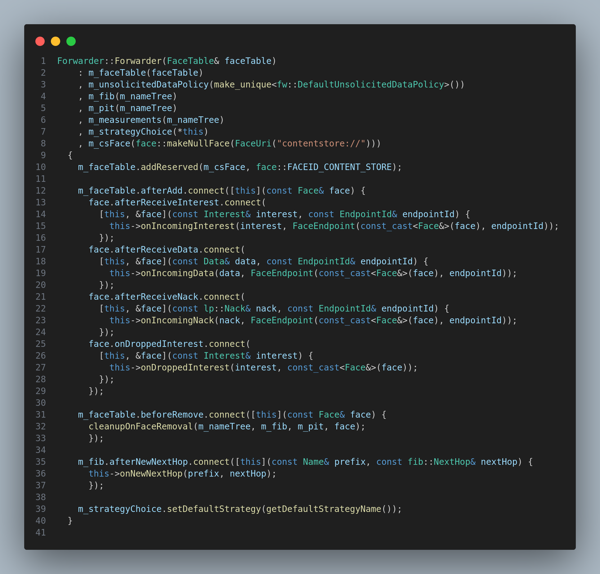
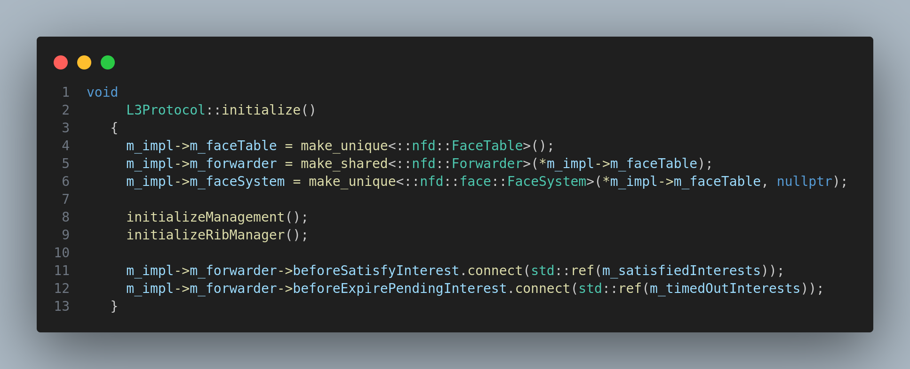
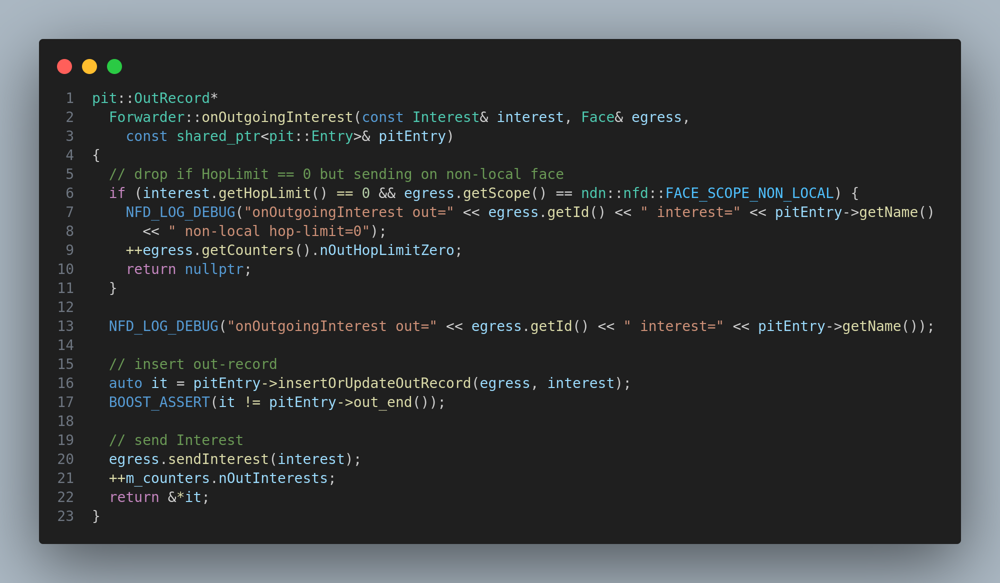
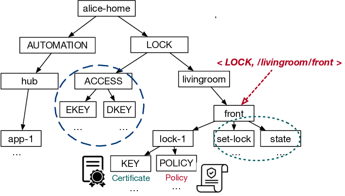

# Forwarder

## Module Description

What is forwarder, how it is implemented in ndnSIM source code, what are individual components of forwarder, how they are implemented and how they interact with each other, what are functionalities provided by forwarder.

## Procedure

`Forwarder` is a class that implements the NDN Forwarding Daemon (NFD) protocol. It is the main component of the NDN Forwarding Daemon (NFD) and is responsible for forwarding Interest and Data packets. It is also responsible for maintaining the FIB and PIT tables. The `Forwarder` class is defined in the `ndnSIM/NFD/daemon/fw/forwarder.hpp` file.

The primary components of the `Forwarder` class are:

- `Fib` - The Forwarding Information Base (FIB) is a data structure that stores the next hop for each prefix. The `Fib` class is defined in the `ndnSIM/NFD/daemon/table/fib.hpp` file.

- `Cs` - The Content Store (CS) is a data structure that stores the Data packets. The `Cs` class is defined in the `ndnSIM/NFD/daemon/table/cs.hpp` file.

- `Pit` - The Pending Interest Table (PIT) is a data structure that stores the pending Interest packets. The `Pit` class is defined in the `ndnSIM/NFD/daemon/table/pit.hpp` file.

- `Strategy` - The Strategy module is responsible for forwarding Interest packets and Data packets. The `Strategy` class is defined in the `ndnSIM/NFD/daemon/fw/strategy.hpp` file.

- `Measurements` - The Measurements module is responsible for collecting and reporting measurements. The `Measurements` class is defined in the `ndnSIM/NFD/daemon/table/measurements.hpp` file.

## Forwarder Constructor

The `Forwarder` class constructor is defined to take only one parameter, which is a reference to the `FaceTable` class. The `FaceTable` class is defined in the `ndnSIM/NFD/daemon/fw/face-table.hpp` file. The `FaceTable` class is responsible for storing the faces that are connected to the forwarder. The `FaceTable` class is used by the `Forwarder` class to forward Interest and Data packets to the connected faces.



> 1. Notice, that `ContentStore` has a special face for communication with the `Forwarder`. This face is used to send unsolicited/ solicited Data packets to the `Forwarder`.
>
> 2. The invidual components of the `Forwarder` are initialized in the `Forwarder` constructor with help of `NameTree`.



> This above code is taken from the `L3Protocol` class which instantiates the `Forwarder` class.
>
> First, the `FaceTable` class is created which is supplies as the argument to the `Forwarder` constructor.
>
> Then, corresponding managers for the invidual components are created.

## Functionality

1. The `Forwarder` class is responsible for forwarding Interest and Data packets. The `Forwarder` class is also responsible for maintaining the FIB and PIT tables.

2. It does all using the standard pipelines associated with each packet type.

3. The packets enter to the `Forwarder` class using the `Face` class.



> The above code shows how the `Forwarder` class handles the outgoing interest packets.

If needed, we can introduce changes into these pipelines to facilitate our needs such as introducing new scope of packets.

This example is already explained on the scope of packets in other modules.

We can get the hold of the forwarder direcly using the `L3Protocol` class.

```cpp

Ptr<Forwarder> forwarder = m_node->GetObject<L3Protocol>()->getForwarder();

```

The `GetObject` method is used to retrieve aggregate objects from the node. 

As initially the `L3Protocol` object is aggregated to the node, we can use the `GetObject` method to retrieve the `L3Protocol` object and then use the `getForwarder` method to retrieve the `Forwarder` object.

We can use the `Forwader` we got from the `L3Protocol` to get the `Fib` and `Pit` objects.

```cpp
// Get L3Protocol [strong pointer] [L3Protocol is owned by Node]
    ns3::Ptr<ns3::ndn::L3Protocol> l3 = nodes.Get(0)->GetObject<ns3::ndn::L3Protocol>();
    std::shared_ptr<ns3::ndn::nfd::FaceTable> faceTable = std::make_shared<ns3::ndn::nfd::FaceTable>(l3->getFaceTable());

    // Get Face [shared_ptr] [Face is owned by FaceManager or by Application]
    std::shared_ptr<ns3::ndn::nfd::Face> face = std::make_shared<ns3::ndn::nfd::Face>(faceTable->get(1));

    // Get Channel (weak_ptr) [Channel is a not owned by Face]
    std::weak_ptr<ns3::ndn::nfd::face::Channel> channel = face->getChannel();

    // Get Pit
    ns3::ndn::nfd::Pit& pit =  l3->getForwarder()->getPit();
```

Feel free to explore the `Forwarder` class and its components to get a better understanding of the `Forwarder` class.

Also refer to the dos and donts before making any changes to the `Forwarder` class.

## NameTree

The `NameTree` is a data structure that is similar to `Trie` data structure. It is used to store the names of the Interest and Data packets with it's corresponding `Fib` and `Pit` entries.

This change is particular to ndnSIM and is not generally found in NFD.

THis change is introduced to use a for all single data structure to store the names of the Interest and Data packets.

To make commutation efficient, it internally uses another data structure based on Hashing. The Hash internally used in `CityHash`.

We know each Prefix can be of variable length and there is high probability of same name is used multiple times. So instead of retrieving everytime, we hash the values based on the Prefixes and store them in the `NameTree`.



source: [Image](https://www.google.com/url?sa=i&url=https%3A%2F%2Fwww.researchgate.net%2Ffigure%2FSketch-of-an-example-name-tree_fig1_348394317&psig=AOvVaw0wdGG0rHNeeDr1xT_6ZRfF&ust=1701671125744000&source=images&cd=vfe&opi=89978449&ved=0CBIQjRxqFwoTCMjtwInR8oIDFQAAAAAdAAAAABAE)