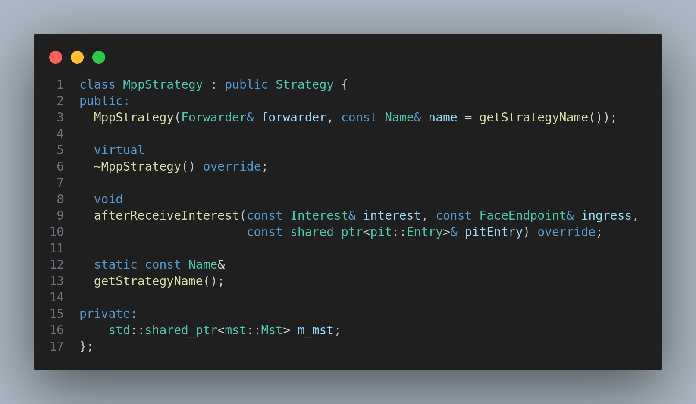

# Forwarding Strategy

## Module Description

In this module, we will learn how to create our own forwarding strategy, what are different types are pre-built forwarding strategies available in ndnSIM and how to use them.

## Procedure

1. Forwarding strategy is a very important component of ndnSIM. It is responsible for forwarding the Interest packets to the appropriate interface.

2. There are many types of forwarding strategies available in ndnSIM. They are:
    * **BestRoute**: This is the default forwarding strategy in ndnSIM. It forwards the Interest packet to the best route available.
    * **MulticastStrategy**: This is used to forward the Interest packet to all the available routes.
    * **NacksFirstStrategy**: This is used to forward the Interest packet to the best route available. If the Interest packet is not satisfied, then it is forwarded to all the available routes.
    * **SmartFloodingStrategy**: This is used to forward the Interest packet to all the available routes. If the Interest packet is satisfied, then it is not forwarded to the other routes.
    * **PerFibLimitsStrategy**
    * **RandomStrategy**
    * **FloodingStrategy**
    * **PerOutFaceLimitsStrategy**

These are some of the pre-built forwarding strategies available in ndnSIM. You can find more forwarding strategies in the [ndnSIM documentation](https://ndnsim.net/current/doxygen/group__ndn-forwarding.html).

3. To create our own forwarding strategy, we need to create a new class which inherits from the `ForwardingStrategy` class. Then we need to override the `doPropagateInterest` method. This method is responsible for forwarding the Interest packet to the appropriate interface. We can also override the `afterReceiveInterest` method. This method is called when the Interest packet is received.

4. Now we need to register our forwarding strategy with the forwarding module. To do this, we need to add the following line in the `RegisterForwardingStrategies` method in the `ndnSIM/ndn-cxx/ndn-cxx/forwarding/forwarding-strategy.hpp` file.

```cpp

void
RegisterForwardingStrategies()
{
  ...
  ...
  ...
  RegisterForwardingStrategy<OurForwardingStrategy>("OurForwardingStrategy");
}

```

5. After registering, we shall create the class in the `ndnSIM/NFD/fw/mpp-strategy` file.

mpp-strategy.hpp



mpp-strategy.cpp

```cpp
        MppStrategy::MppStrategy(Forwarder& forwarder, const Name& name)
            : Strategy(forwarder)
        {
            this->setInstanceName(makeInstanceName(name, getStrategyName()));

            this->m_mst = std::make_shared<mst::Mst>(forwarder.getMst());
        }

        MppStrategy::~MppStrategy()
        {
        }

        static bool
            canForwardToNextHop(const Face& inFace, shared_ptr<pit::Entry> pitEntry, const fib::NextHop& nexthop)
        {
            return !wouldViolateScope(inFace, pitEntry->getInterest(), nexthop.getFace());
        }

        static bool
            hasFaceForForwarding(const Face& inFace, const fib::NextHopList& nexthops, const shared_ptr<pit::Entry>& pitEntry)
        {
            return std::find_if(nexthops.begin(), nexthops.end(), bind(&canForwardToNextHop, cref(inFace), pitEntry, _1))
                != nexthops.end();
        }

                 void
            MppStrategy::afterReceiveInterest(const Interest& interest, const FaceEndpoint& ingress,
                const shared_ptr<pit::Entry>& pitEntry)
        {
            NFD_LOG_TRACE("afterReceiveInterest");

            if (hasPendingOutRecords(*pitEntry)) {
                // not a new Interest, don't forward
                return;
            }

            // get all nexthops
            const fib::Entry& fibEntry = this->lookupFib(*pitEntry);
            const fib::NextHopList& nexthops = fibEntry.getNextHops();

            // Ensure there is at least 1 Face is available for forwarding
            if (!hasFaceForForwarding(ingress.face, nexthops, pitEntry)) {
                this->rejectPendingInterest(pitEntry);
                return;
            }

            // select a Face to forward Interest
            fib::NextHopList::const_iterator selected;

            // If there is only 1 Face, forward to it
            if (nexthops.size() == 1) {
                selected = nexthops.begin();
            }
            else {
                // get all faces with their mpp value from mst table
                std::vector<std::pair<std::shared_ptr<Face>, double>> allFaces =
                    this->m_mst->getFaceProps(interest.getName().toUri());

                // select best face among the all faces
                double max = 0;
                std::shared_ptr<Face> maxFace = nullptr;

                for (auto& face : allFaces) {
                    if (face.second > max) {
                        max = face.second;
                        maxFace = face.first;
                    }
                }

                // check if maxFace is valid or probility is greater than 0.5, else let the default strategy handle it
                if (maxFace == nullptr || max < 0.5) {
                    // no face found
                }

                // find the selected face in the nexthops
                selected = std::find_if(nexthops.begin(), nexthops.end(),
                    [maxFace](const fib::NextHop& nexthop) {
                        return nexthop.getFace().getId() == maxFace->getId();
                    });

                // check if the selected face is valid or not
                if (selected == nexthops.end()) {
                    // no face found
                    this->rejectPendingInterest(pitEntry);
                    return;
                }
                else {
                    NFD_LOG_TRACE("mpp select face: " << maxFace->getId());
                    // successfully found the face, so forward the interest
                    this->sendInterest(interest, *maxFace, pitEntry);
                }
            }

            // select best hops from nexthops
            int besthop = 0;
            for (int i = 0; i < nexthops.size(); i++) {
                if (nexthops[i].getCost() < nexthops[besthop].getCost()) {
                    besthop = i;
                    break;
                }
            }

            // send the interest to the selected face
            selected = nexthops.begin() + besthop;

            // forward the interest
            this->sendInterest(interest, selected->getFace(), pitEntry);
        }

        const Name&
            MppStrategy::getStrategyName()
        {
            static Name strategyName("ndn:/localhost/nfd/strategy/mpp-share/%FD%01");
            return strategyName;
        }
```

> To understand more about the code in constructor of the class, please refer `strategy.hpp` file in the `ndnSIM/NFD/daemon/fw/strategy.hpp` directory. Specifically, the `makeInstanceName` method.