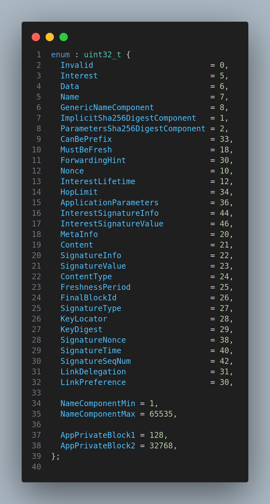

# How to include new field in data packet

## Module description

In this module, we will learn how to include new field in the data packet.

## Procedure

1. Create a new field in the data packet. This where we store the value of new field.

2. Then add the new field in the [tlv.hpp](https://github.com/named-data-ndnSIM/ndn-cxx/blob/2b51e5796415b5d41fe268b35250b9453f16d3d6/ndn-cxx/encoding/tlv.hpp) file in the ndn-cxx library.

We suppose add it here because each tlv number is associated with a field in the data packet. Even if it is optional, we need to add it here to avoid any conflict.

To be more specific, add the new field in the 
[TLV-NUMBER](https://github.com/named-data-ndnSIM/ndn-cxx/blob/2b51e5796415b5d41fe268b35250b9453f16d3d6/ndn-cxx/encoding/tlv.hpp#L63)

TLV is 3 parts:

The encoding of TLV has 4 types based on how many bytes are used to encode the type and length.

* Type: variable length
* Length: variable length
* Value: variable length

3. Make sure to add appropriate `getter` and `setter` methods to access the variable because it is a private variable.

4. Now add that variable to [meta-info.hpp] in `MetaInfo::wireEncode` method and also in `MetaInfo::wireDecode` method to encode and decode the variable to `Blocks` and `Wire` format.

Refer this website for more information about [TLV](https://docs.named-data.net/NDN-packet-spec/current/tlv.html).