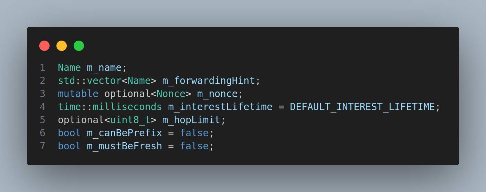
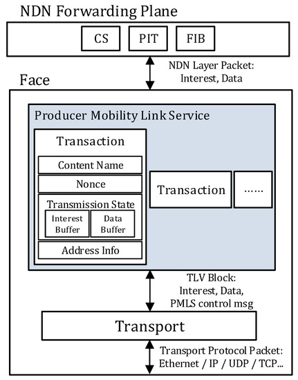
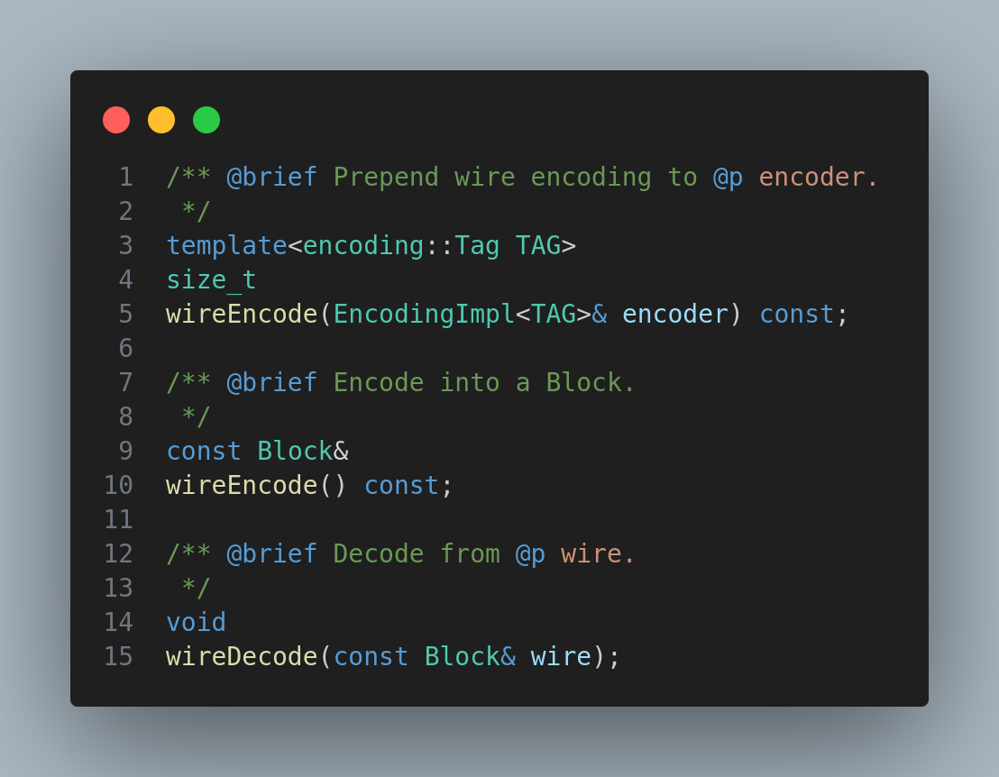
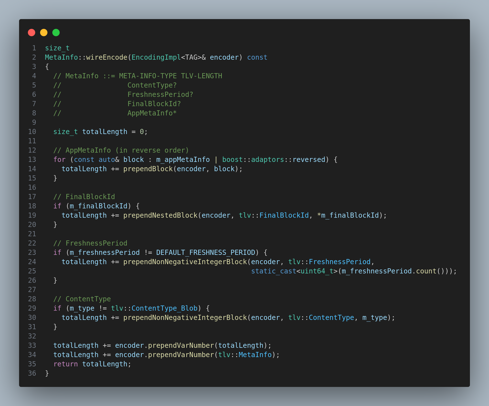
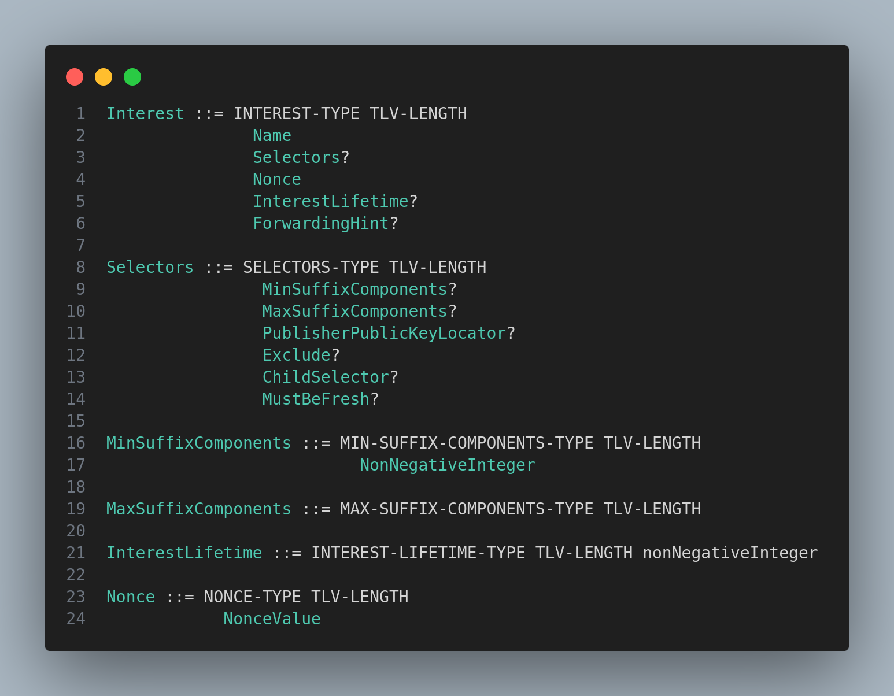
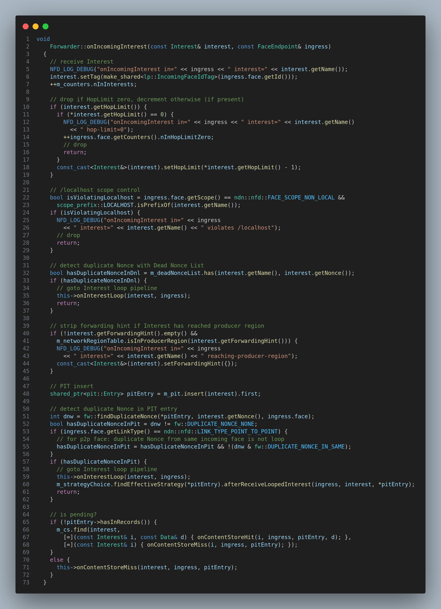

# Interest Packet

<!-- What is interet packet, which file , 
what are the fields inside ithttps://named-data.net/doc/ndn-cxx/current/tutorials/interest-encoding.html, a picture, 
how it is communicated in ns-3 medium (using face,block, tlv format, uses of interest packets, how interest packet is handled(forwarder,face) ) -->

## Module Description

In this module, we will learn about the Interest packet. What are the main fields inside the Interest packet, how it is communicated in the NDN network, and how it is handled by the NDN forwarder.

## Procedure

### What is an Interest packet?

An Interest packet is a packet that is used by the consumer to request data from the network. It is a packet that is sent by the consumer to the network to request data from the network.

Interest packet is implemented by `Interest` class in  [interest.hpp](https://github.com/named-data-ndnSIM/ndn-cxx/blob/2b51e5796415b5d41fe268b35250b9453f16d3d6/ndn-cxx/interest.hpp#L48) file in the ndn-cxx library.

### What are the main fields inside the Interest packet?

The main fields inside the Interest packet are:

1. Name
2. Selectors
3. Nonce
4. Interest Lifetime
5. Hop Limit
6. Must Be Fresh
7. Forwarding Hint

Taken from the private field section of the Interest class.

### How is Interest packet communicated in the NDN network?

Interest packet is communicated in the NDN network using the `Face` class. The `Face` class is used to communicate with the NDN network. It is used to send and receive Interest and Data packets.

The abstraction behind the `Face` class is that it is a communication channel between the consumer and the network. 

The Interest packet is converted into `Block` format which defines ndn specific TLV format and then it is sent to the network using the `Face` class.

The converted block code is also called as the wire format of the Interest packet or encoding of the Interest packet.

The encoding is done by the method specified in the  `Interest` class. The method is `wireEncode`.

This above code snipptet is from `meta-info.cpp` class in ndn-cxx library.

I can't find the source code implementation of the `wireEncode` method, but i found source code implementation in `python` bindings and also a webpage that explains the encoding of the Interest packet.

The source code implementation of the `wireEncode` method in python bindings is [here](https://python-ndn.readthedocs.io/en/latest/src/encoding/encoding.html)

The webpage that explains the encoding of the Interest packet is [here](https://docs.named-data.net/NDN-packet-spec/current/)

Only few fields are shown in the above picture.

### How is Interest packet handled by the NDN forwarder?

The Interest packet is handled by the NDN forwarder using the `Forwarder` class. The `Interest` packet reaches the realm of the forwarder using the `Face` class. The `Face` class is used to send and receive Interest and Data packets.

On `Face` class receiving the Interest packet, the `OnIncomingInterest` method of the `Forwarder` class is called. The `OnIncomingInterest` method of the `Forwarder` class is used to handle the Interest packet.

The `Face` class calls `OnIncomingInterest` doesn't directly call the `OnIncomingInterest` method of the `Forwarder` class. It uses the `LinkService` class to call the `OnIncomingInterest` method of the `Forwarder` class.

That is called by the [Transport](https://github.com/named-data-ndnSIM/ndn-cxx/blob/2b51e5796415b5d41fe268b35250b9453f16d3d6/ndn-cxx/transport/transport.hpp) class.

There are many other functions in the `Forwarder` class that are used to handle the Interest and Data packets.

## Use of Interest packet

The Interest packet is used by the consumer to request data from the network. It is used by the consumer to request data from the network.

Another use of the Interest packet to communicate with the network. For sending information to neighbouring router's, the Interest packet is used.

This in more detail is discussed in [Communicate with different nodes](./communicate_with_diff_nodes.pdf)