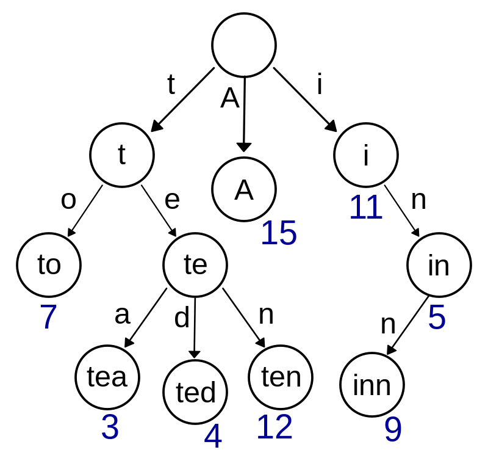

# Our own Tables

## Module Description

In this module, we will learn how to create our own tables.
This is not specific to ndnSIM, but it is a good practice to create our own tables to store the information we need in c++.

## Tasks

|Sno|Name|Age|Gender|
|---|----|---|------|
|0|John|20 |Male  |
|1|Jane|19 |Female|
|2|Jack|21 |Male  |
|3|Smith|22|Male  |

We will create a table to store the above information in different ways. 

1. Using `vector`
2. Using `map`
3. Using `set`

Each has its own advantages and disadvantages.

#### Vector vs Map vs Set

| |Vector|Map|Set|
|---|---|---|---|
|Order|Ordered|Ordered|Unordered|
|Search|O(n)|O(log n)|O(log n)|
|Insert|O(1)|O(log n)|O(log n)|
|Delete|O(n)|O(log n)|O(log n)|
|Memory|More|More|Less|
|Duplicates|Allowed|Not Allowed|Not Allowed|
|When to use|When you need to access elements by index|When you need to access elements by key|When you need to access elements by key and you don't need duplicates|
|Library|`#include <vector>`|`#include <map>`|`#include <set>`|
|Note|`vector` is a sequence container and also known as Dynamic Array or Array List|`map` is an associative container that stores elements in key value combination|`set` is an associative container that contains a sorted set of unique objects of type Key|

## Procedure

### Using `vector`

```cpp
#include <iostream>
#include <vector>
#include <string>

class Info {
    explicit Info(std::string p_name, uint8_t p_age, char p_gender) {
        this -> m_name = p_name;
        this -> m_age = p_age;
        this -> m_gender = p_gender;
    }

    static void print_header() {
        std::cout << "Name\tAge\tGender\n";
    }

    void print_info() {
        std::cout << m_name << "\t" << m_age << "\t" << (m_gender=='M'?"Male":"Female") << "\n";
    }

    private:
    std::string m_name;
    uint8_t m_age;
    char m_gender; // 'M' or 'F'
};

int main(int argc, char*argv[]) {
    std::vector<Info> info_table;

    info_table.push_back(Info("John", 20, 'M'));
    info_table.push_back(Info("Jane", 19, 'F'));
    info_table.push_back(Info("Jack", 21, 'M'));
    info_table.push_back(Info("Smith", 22, 'M'));

    Info::print_header();

    for (auto info : info_table) {
        info.print_info();
    }
}

```

### Using `map`

```cpp
#include <iostream>
#include <map>
#include <string>
#include <tuple>

class Info {
    explicit Info(std::string p_name, uint8_t p_age, char p_gender) {
        this -> m_name = p_name;
        this -> m_age = p_age;
        this -> m_gender = p_gender;
    }

    static void print_header() {
        std::cout << "Name\tAge\tGender\n";
    }

    void print_info() {
        std::cout << m_name << "\t" << m_age << "\t" << (m_gender=='M'?"Male":"Female") << "\n";
    }

    private:
    std::string m_name;
    uint8_t m_age;
    char m_gender; // 'M' or 'F'
};


int main(int argc, char*argv[]) {
    std::map<int, Info> info_table;

    info_table[0] = Info("John", 20, 'M');
    info_table[1] = Info("Jane", 19, 'F');
    info_table[2] = Info("Jack", 21, 'M');
    info_table[3] = Info("Smith", 22, 'M');

    Info::print_header();

    for(std::pair<int, const Info&> info : info_table) {
        info.second.print_info();
    }
}

```

### Using `set`

```cpp

#include <iostream>
#include <set>
#include <string>

class Info {
    explicit Info(std::string p_name, uint8_t p_age, char p_gender) {
        this -> m_name = p_name;
        this -> m_age = p_age;
        this -> m_gender = p_gender;
    }

    static void print_header() {
        std::cout << "Name\tAge\tGender\n";
    }

    void print_info() {
        std::cout << m_name << "\t" << m_age << "\t" << (m_gender=='M'?"Male":"Female") << "\n";
    }

    private:
    std::string m_name;
    uint8_t m_age;
    char m_gender; // 'M' or 'F'
};

int main(int argc, char*argv[]) {
    std::set<Info> info_table;

    info_table.insert(Info("John", 20, 'M'));
    info_table.insert(Info("Jane", 19, 'F'));
    info_table.insert(Info("Jack", 21, 'M'));
    info_table.insert(Info("Smith", 22, 'M'));

    Info::print_header();

    for (auto info : info_table) {
        info.print_info();
    }
}

```

Here we discussed about generic case but we can use the same to implement for complex structures with knowledge of smart pointers, lvalues, rvalues, references, etc.

### Trie 

Trie is a tree-like data structure whose nodes store the letters of an alphabet. By structuring the nodes in a particular way, words and strings can be retrieved from the structure by traversing down a branch path of the tree.

This data structure is used to store information with name of the interest as the key.




```cpp

#include <iostream>
#include <string>
#include <vector>
#include <memory>

class Trie {
    public:
    Trie() {
        m_root = std::make_shared<Node>();
    }

    void insert(std::string word) {
        std::shared_ptr<Node> current = m_root;
        for (char c : word) {
            if (current -> m_children[c - 'a'] == nullptr) {
                current -> m_children[c - 'a'] = std::make_shared<Node>();
            }
            current = current -> m_children[c - 'a'];
        }
        current -> m_is_word = true;
    }

    bool search(std::string word) {
        std::shared_ptr<Node> current = m_root;
        for (char c : word) {
            if (current -> m_children[c - 'a'] == nullptr) {
                return false;
            }
            current = current -> m_children[c - 'a'];
        }
        return current -> m_is_word;
    }

    bool startsWith(std::string prefix) {
        std::shared_ptr<Node> current = m_root;
        for (char c : prefix) {
            if (current -> m_children[c - 'a'] == nullptr) {
                return false;
            }
            current = current -> m_children[c - 'a'];
        }
        return true;
    }

    private:
    struct Node {
        std::vector<std::shared_ptr<Node>> m_children;
        bool m_is_word;

        Node() {
            m_children.resize(26);
            m_is_word = false;
        }
    };

    std::shared_ptr<Node> m_root;
};

int main(int argc, char*argv[]) {
    Trie trie;
    trie.insert("apple");
    std::cout << trie.search("apple") << "\n";   // returns true
    std::cout << trie.search("app") << "\n";     // returns false
    std::cout << trie.startsWith("app") << "\n"; // returns true
    trie.insert("app");
    std::cout << trie.search("app") << "\n";     // returns true
}

```